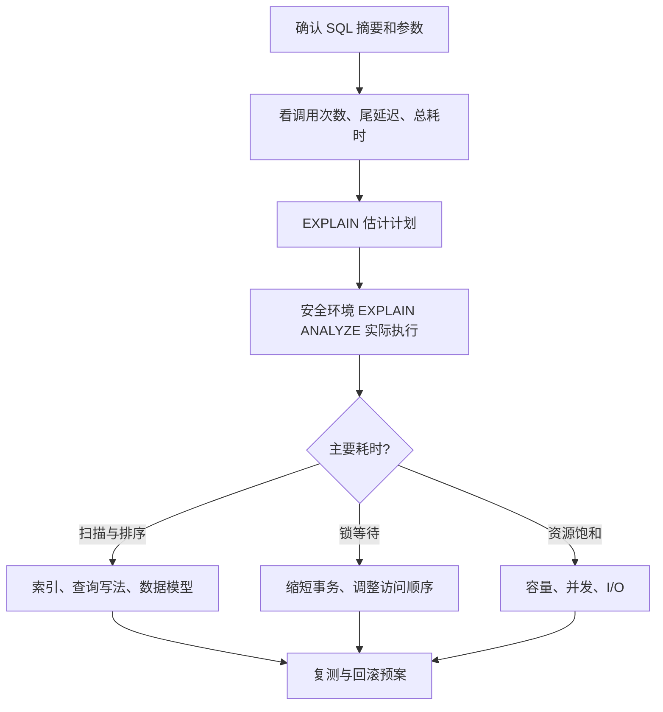

# 如何分析和优化慢SQL？慢查询的常见原因有哪些？

日期：2026-09-27  
标签：#面试 #MySQL #数据库  
难度：困难  
来源：[牛面 MySQL 题库](https://niumianoffer.com/nm_practice/questions?bank_id=50e19cbb-21c2-4330-b45f-5748ae5d8672&activeIndex=0)  
答案说明：独立整理（站内题目标记为 VIP，未读取会员答案）

## 一句话答案

先用延迟、频次和等待信息锁定具体 SQL 与瓶颈，再用执行计划和实际执行数据验证假设；按扫描、排序、锁或资源原因改动，并用同一工作负载复测。

## 面试口语版（约 70 秒）

“我会先确认慢的是单条 SQL 还是整体数据库过载：从应用调用链、慢查询日志、Performance Schema 的语句摘要看 P95/P99、调用次数和总耗时。拿到 SQL、绑定参数、表数据量和索引后先看 `EXPLAIN`，再在安全环境对代表性 `SELECT` 用 `EXPLAIN ANALYZE`，比较估计行数与实际行数、循环次数、表扫描、排序和临时表。若扫描太多，就检查过滤条件与联合索引顺序；若估计偏差大，检查统计信息与数据倾斜；若执行计划看似正常但仍慢，查锁等待、磁盘 I/O、缓冲池和并发。比如按 `tenant_id`、`status`、`created_at` 查询订单，索引要跟过滤及排序路径匹配，避免 `SELECT *` 带来大量回表。上线前比较旧新计划、写入成本与同负载下延迟，不能只看一次运行变快。”

## 排查流程与常见原因

| 现象 | 可能原因 | 进一步证据 |
| --- | --- | --- |
| 实际扫描行数远大于返回行数 | 缺合适索引、条件不可有效利用索引、低选择性 | `rows examined`、实际迭代器行数、索引选择 |
| 估计与实际行数差距大 | 统计信息过期或数据分布不均 | 统计信息、参数分布、计划变化 |
| 排序或临时表明显 | `ORDER BY/GROUP BY` 与索引不匹配、结果集过大 | 执行计划节点、临时表/排序指标 |
| 扫描不大仍很慢 | 锁等待、I/O 饱和、连接排队 | 等待事件、事务状态、主机资源 |

**示例：** `SELECT id, amount FROM orders WHERE tenant_id=? AND status=? ORDER BY created_at DESC, id DESC LIMIT 20`。先比较现有索引与 `(tenant_id, status, created_at DESC, id DESC)` 的计划和实际耗时；如果 `status` 选择性差或还有其他高频访问路径，需结合真实负载重新设计，不能机械照搬索引。新增索引会增加写入与存储成本。

## 关键细节与常见误区

- MySQL 8.4 的 `EXPLAIN ANALYZE` **会执行语句**，返回迭代器的实际耗时、行数与循环次数；文档支持 `SELECT`、`TABLE` 及多表 `UPDATE`/`DELETE`，不能把它当作所有 DML 的只读分析命令，更新/删除尤其要在隔离环境谨慎使用。
- `EXPLAIN` 是估计计划，不等于线上实际耗时；`Using filesort` 表示额外排序，并不必然是磁盘文件排序。
- 盲目扩大 `LIMIT` 或建立多个重复索引会让写入变慢；优化目标应是业务端尾延迟、吞吐与资源占用。
- 慢日志阈值以上的查询有用，但高频“中等慢”SQL 也可能占据最多总耗时，需结合语句摘要排优先级。

## 面试官递进追问

### 1. `EXPLAIN` 的估计行数与 `EXPLAIN ANALYZE` 实际行数差很多时先查什么？

**参考答案：** 先确认比较的是同一 SQL、同一组绑定参数、同一实例和相近数据量，再对齐执行计划中的同一个迭代器；不能把单次循环的行数与整个连接的总行数比较。重点检查近期批量导入或删除后统计信息是否失真、租户或状态分布是否倾斜，以及多个条件是否高度相关。可在受控窗口执行 `ANALYZE TABLE orders` 更新索引统计；有明显列值倾斜时再评估直方图。随后用冷热参数分别复测估计行数、实际行数和 `loops`，确认访问路径改善；统计更新也可能改变其他 SQL 的计划，不能只测一个参数。[官方依据：EXPLAIN 分析](https://dev.mysql.com/doc/refman/8.4/en/using-explain.html)。

### 2. 已命中索引却仍慢，如何判断是大量回表、排序还是锁等待？

**参考答案：** “命中索引”只说明选了某条访问路径，不说明扫描或回表次数少。我会先看实际读取量与返回量：二级索引扫描很多、查询又取非索引列时，结合表/索引 I/O 等待及相同过滤条件的覆盖查询对照，判断回表是否占主要成本；执行计划未必把每次回表单独列成节点。排序看 Sort 节点输入量、耗时和排序归并、临时文件 I/O，`Using filesort` 本身不能证明落盘。锁等待则在慢请求发生时查 `performance_schema.data_lock_waits`、事务与阻塞者，DDL 相关等待另查 `metadata_locks`。计划节点耗时可能包含子节点，不能直接全部相加，也不能拿事后一次快查询排除线上争锁。

### 3. 新增联合索引让查询变快但写入 P99 变差，如何取舍和回滚？

**参考答案：** 先排除“正在建索引”的临时 I/O 和元数据锁影响，再用相同流量对比建成后的查询收益、写入 P99、redo 量、刷脏和空间占用。若查询低频但每次写入都要维护一个宽索引，通常应缩短索引、合并冗余索引或调整查询；核心查询收益明显且写入仍满足目标，才保留。回滚要分清两件事：设为不可见可以测试恢复旧查询计划，但它仍参与写入维护，不能消除写入成本；确认无约束和其他查询依赖后删除新增索引，才移除这部分维护负担，并观察 DDL 等待及延迟恢复情况。[官方依据：不可见索引](https://dev.mysql.com/doc/refman/8.4/en/invisible-indexes.html)。

## 自测与学习清单

- 对一条含过滤、排序和分页的 SQL 写出证据收集顺序，而非直接回答“加索引”。
- 用代表性参数记录改动前后的计划、实际行数、P95/P99、写入成本。
- 将慢 SQL 分成扫描、计划估计、等待和容量四类，给每类列出验证指标。

## 延伸阅读

- [049-slow-sql-monitoring-optimization.md](/posts/MySQL/049-slow-sql-monitoring-optimization/)
- [034-explain-query-analysis.md](/posts/MySQL/034-explain-query-analysis/)
- [同题场景版参考答案](/posts/%E5%9C%BA%E6%99%AF%E9%9D%A2%E8%AF%95%E9%A2%98/23-mysql-slow-sql/)

## 参考资料

- [MySQL 8.4：EXPLAIN 与 EXPLAIN ANALYZE](https://dev.mysql.com/doc/refman/8.4/en/explain.html)、[Performance Schema 语句摘要](https://dev.mysql.com/doc/refman/8.4/en/performance-schema-statement-digests.html)（核对日期：2026-09-27）。
