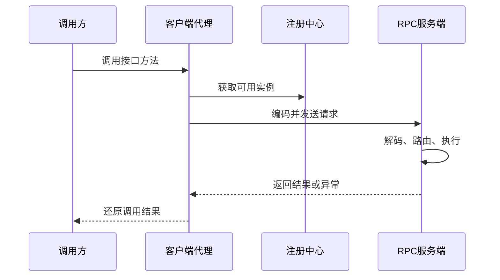

# 设计一个 RPC 框架

日期：2026-07-11  
标签：#面试 #八股 #后端 #系统设计 #场景题

## 一句话答案

RPC 框架的本质是用动态代理屏蔽远程调用细节，并围绕协议、序列化、连接、服务发现、负载均衡、容错和可观测性构建完整调用链。

## 面试口语版

客户端调用本地代理，代理把接口名、方法名、参数类型、参数值、请求 ID 和超时时间编码成请求，通过连接池发送给服务端。服务端解码后从本地服务注册表找到实现并反射或生成字节码调用，再返回结果。生产级框架还要接入注册中心、负载均衡、超时、重试、熔断、限流、鉴权、链路追踪和优雅上下线。设计时重点处理幂等、重试风暴、版本兼容和网络半开问题。

## 原理拆解

- **API 层**：接口定义、注解、代理生成、同步/异步调用。
- **协议层**：魔数、版本、消息类型、序列化类型、压缩类型、请求 ID、正文长度。
- **传输层**：TCP/HTTP2、长连接、心跳、连接池、粘包拆包、背压。
- **治理层**：注册发现、负载均衡、健康检查、超时、有限重试、熔断、隔离和限流。
- **扩展层**：SPI 插件机制支持序列化器、负载策略和注册中心替换。
- **观测层**：指标、日志、Trace ID、慢调用采样、错误码。

## 关键细节

- 超时预算应沿调用链递减，不能每一跳都重新给完整超时。
- 重试只适合幂等请求，且应换节点、指数退避并限制次数。
- 服务端先从注册中心摘除，再停止接流量，等待在途请求完成。
- 协议字段要支持向前/向后兼容；异常应映射为稳定错误码。

## 面试官追问

1. TCP 如何处理粘包、拆包？
2. 如何实现请求和响应的异步关联？
3. 服务发现数据不一致怎么办？
4. 如何避免重试放大故障？
5. 如何实现优雅上下线？

## 面试官追问参考答案

### 1. TCP 如何处理粘包、拆包？

TCP 是字节流，没有消息边界。应用协议可采用固定长度、分隔符或“消息头长度字段 + 消息体”，RPC 通常先读取固定头，再按 body length 累积读取完整帧，同时校验最大长度，防止恶意包占满内存。

### 2. 如何实现请求和响应的异步关联？

客户端为每次请求生成唯一 requestId，并把 `requestId -> Promise/CompletableFuture` 放入并发表。网络线程收到响应后按 requestId 找到 Future 并完成它；超时、连接断开或取消时必须删除映射并完成异常，避免内存泄漏。

### 3. 服务发现数据不一致怎么办？

注册中心数据本身允许短暂最终一致，因此客户端要缓存实例列表、监听增量变化并定期全量校准。真正调用前结合健康检查、失败摘除和负载均衡；注册中心不可用时使用最近一次快照，但设置最大陈旧时间，避免永久调用已下线实例。

### 4. 如何避免重试放大故障？

只对幂等请求和明确的瞬态错误重试，限制最大次数并采用指数退避加随机抖动。重试应换节点、受总 Deadline 和全局重试预算约束，并配合熔断、限流；调用链上通常只选择一层重试，避免每层重试形成乘法放大。

### 5. 如何实现优雅上下线？

上线时先完成初始化和健康检查，再注册或开放 Readiness。下线时先从注册中心摘除并停止接新请求，等待客户端感知和在途请求结束，然后关闭线程池、连接和资源；超过最大等待时间再强制退出，并确保消费者先停止拉取新消息。

