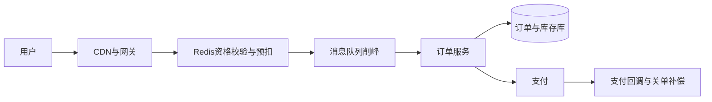

# 设计秒杀功能

日期：2026-07-11  
标签：#面试 #八股 #后端 #系统设计 #场景题

## 一句话答案

秒杀系统要通过静态化、限流、削峰、原子扣库存和异步下单，把巨大瞬时流量挡在核心数据库之外，同时保证不超卖、少卖可补偿。

## 面试口语版

入口先做 CDN 静态化、验证码或动态路径防刷，在网关按用户、IP 和活动限流。请求进入后先校验资格与一人一单，再用 Redis Lua 原子判断并预扣库存，成功请求写入消息队列，订单服务异步创建订单并最终扣减数据库库存。库存以数据库为最终事实，Redis 是前置令牌；消费失败要重试和补偿，支付超时要关单并回补库存。整个链路都要幂等，并提供降级开关和热点隔离。

## 关键细节

- Redis Lua 同时校验库存、用户购买标记并扣减，保证单分片原子性。
- MQ 生产确认、消费幂等和死信补偿共同保证请求不丢。
- 数据库扣库存使用 `stock > 0` 条件更新，作为最后防线。
- 订单状态机：待支付 → 已支付/已取消；超时关单和支付回调要防并发竞态。
- 热点 Key 可分桶，但分桶后需处理总量分配与尾部库存归并。

## 面试官追问

1. Redis 扣成功但消息发送失败怎么办？
2. 如何保证一人一单？
3. 库存回补时遇到迟到支付怎么办？
4. Redis 集群热点 Key 如何解决？
5. 如何做容量评估与压测？

## 面试官追问参考答案

### 1. Redis 扣成功但消息发送失败怎么办？

可使用本地事务消息表或可靠事件：先把预扣结果与待发送事件形成可查询记录，再由后台重试发送；也可使用支持事务消息的 MQ。若最终确认无法发送，则通过唯一业务流水幂等回补 Redis 库存，不能依赖一次网络调用。

### 2. 如何保证一人一单？

Redis Lua 中以 `activityId + userId` 检查购买标记并和扣库存原子执行，数据库再对活动和用户建立唯一约束兜底。即使消息重复消费，订单插入也因唯一键只成功一次，并返回已有订单。

### 3. 库存回补时遇到迟到支付怎么办？

订单必须通过条件状态转换处理：只有成功从待支付改为已取消的线程才能回补。支付回调若先成功则关单失败；若取消先成功但渠道后来确认支付，则记录异常支付并自动退款，不能重新消耗已回补且可能售出的库存。

### 4. Redis 集群热点 Key 如何解决？

入口先做本地缓存和资格过滤，减少访问 Redis；库存可以预分配到多个逻辑桶，用户稳定路由到桶，并在尾部做库存归并。只增加 Redis 分片无法拆散单 Key，必要时使用读副本仅承担读校验，核心扣减仍须落到确定分片原子执行。

### 5. 如何做容量评估与压测？

从活动人数、入口峰值、有效下单率和目标延迟估算各层 QPS，再按网关、Redis、MQ、订单库分别压测。压测要包含热点 Key、库存售罄、超时重试、消费者积压和节点故障，并验证限流阈值、降级开关及资源水位，而不仅看平均吞吐。

