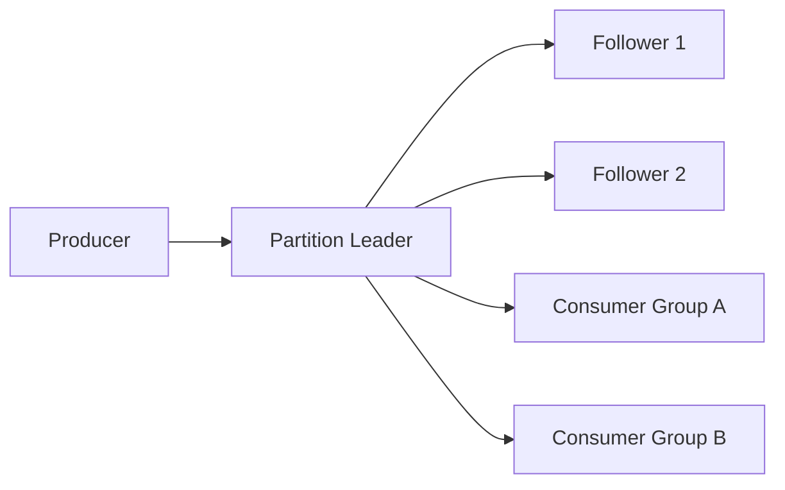

# 设计消息队列

日期：2026-07-11  
标签：#面试 #八股 #后端 #系统设计 #场景题

## 一句话答案

消息队列围绕持久化日志构建，通过分区实现吞吐扩展，通过副本实现高可用，通过位点和投递协议实现至少一次等消费语义。

## 面试口语版

我会把 Topic 拆成多个 Partition，每个分区是磁盘顺序追加日志，分区内有序。Producer 根据 Key 选分区，Broker 追加日志并按确认级别响应；Consumer Group 内一个分区同一时刻只分配给一个消费者，消费者拉取消息并提交 Offset。高可用上每个分区有 Leader 和 Follower，通过多数派或 ISR 复制后确认。还要设计索引、批量发送、零拷贝、保留策略、重试、死信、再均衡、监控和权限控制。

## 关键细节

- **存储**：顺序写 CommitLog，稀疏索引定位，分段文件便于删除和恢复。
- **可靠性**：生产确认 + 多副本复制 + 消费确认；至少一次下消费者必须幂等。
- **顺序性**：只能保证分区内有序；同一业务 Key 固定路由到一个分区。
- **高可用**：Leader 选举时避免选取数据落后副本，否则会丢消息。
- **积压**：增加分区和消费者、批量消费、限流生产端，必要时旁路转储。
- **事务消息**：半消息、业务本地事务、提交/回滚以及事务状态回查。

## 面试官追问

1. 如何做到消息不丢？
2. 重复消息如何处理？
3. 如何保证顺序消费？
4. Broker 宕机如何选主？
5. 消息积压如何排查和处理？

## 面试官追问参考答案

### 1. 如何做到消息不丢？

生产端等待 Broker 确认并对失败重试，Broker 使用顺序日志、刷盘策略和多副本确认，消费端业务完成后再提交位点。还要用监控和对账发现链路缺口；“不丢”通常以至少一次为基础，因此消费者必须接受可能重复。

### 2. 重复消息如何处理？

优先让业务操作天然幂等，例如状态条件更新；否则以业务唯一键建立数据库唯一约束，或维护去重表记录消息 ID。去重记录必须与业务变更处于同一事务边界，且需明确保存周期，不能只在内存中去重。

### 3. 如何保证顺序消费？

将需要有序的同一业务 Key 固定路由到同一分区，分区内由一个消费者串行处理。失败消息不能简单跳过，可阻塞重试、暂停该 Key 或转入有序重试队列；全局顺序通常意味着单分区，会牺牲吞吐和可用性。

### 4. Broker 宕机如何选主？

副本持续复制 Leader 日志，控制器从满足同步条件且数据足够新的副本中选新 Leader，并通过 Epoch/Term 防止旧 Leader 继续写。多数派协议强调已提交日志不能回退；ISR 方案要谨慎配置是否允许非同步副本当选。

### 5. 消息积压如何排查和处理？

先比较生产速率、消费速率和 Lag，确认是消费实例不足、单条处理变慢、分区倾斜还是下游故障。止损时可扩消费者到不超过有效分区数、批量消费、临时转储积压并限流生产端；根治慢逻辑和热点分区后再平稳回放，避免压垮下游。

