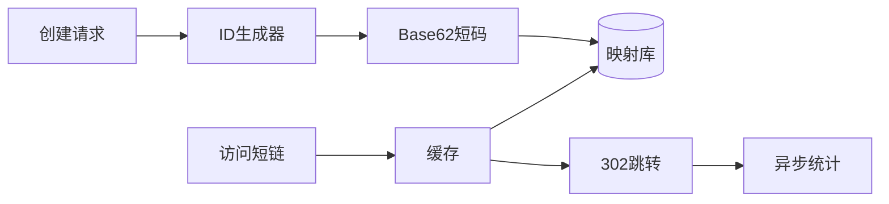

# 设计短链系统

日期：2026-07-11  
标签：#面试 #八股 #后端 #系统设计 #场景题

## 一句话答案

短链系统通过唯一短码映射原始 URL，读路径使用缓存和数据库快速重定向，写路径重点解决短码生成、冲突、滥用治理和统计分析。

## 面试口语版

创建短链时先校验 URL 和权限，生成全局唯一 ID，再用 Base62 编码得到短码，保存 `code -> long_url` 映射。访问时先查本地缓存和 Redis，未命中再查分库数据库，返回 302 跳转，并异步上报访问统计。读多写少场景要做缓存、布隆过滤器防穿透和热点保护；安全上需要域名黑名单、恶意内容检测、访问限流和过期机制。

## 关键细节

- Base62 只编码 ID，不等于加密；若担心连续 ID 可做可逆扰动或随机码碰撞重试。
- 301 便于浏览器缓存但不利于实时统计和目标修改；业务短链通常选 302。
- 分库可按短码哈希；自定义别名需唯一索引。
- 删除或过期映射要同步清理缓存，并防止短码过早复用。

## 面试官追问

1. 短码长度如何估算？
2. 如何解决随机短码碰撞？
3. 热门短链打爆单个 Redis 节点怎么办？
4. 301 和 302 如何选择？

## 面试官追问参考答案

### 1. 短码长度如何估算？

Base62 长度为 n 时空间是 `62^n`。应根据预计累计链接数、增长年限、保留率和安全余量选择，例如 7 位约有 3.5 万亿种组合；若使用随机码，还要考虑生日碰撞，不能把空间用到接近满载。

### 2. 如何解决随机短码碰撞？

数据库对 code 建唯一索引，插入冲突时重新生成并有限重试；为降低冲突，可增加长度或用全局唯一 ID 经过 Base62 编码。随机码生成器要有足够熵，不能只靠进程内时间戳。

### 3. 热门短链打爆单个 Redis 节点怎么办？

在应用侧增加本地缓存并设置短 TTL，配合请求合并，绝大多数跳转不再访问 Redis。还可把只读映射复制到多个缓存 Key 或只读副本，用 CDN/边缘计算直接返回跳转；更新时通过版本或消息主动失效。

### 4. 301 和 302 如何选择？

301 表示永久重定向，浏览器和 CDN 可能长期缓存，减少服务端流量但不利于修改目标和完整统计。302 是临时重定向，请求通常仍经过短链服务，便于控制和统计；业务短链常选 302，固定永久链接才考虑 301。

