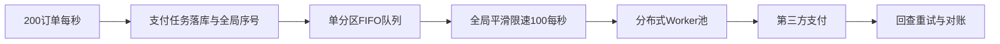

# 每秒 200 笔订单进入，第三方支付限流 100 笔/秒，如何设计分布式 FIFO 支付服务？

日期：2026-07-12  
标签：#面试 #八股 #后端 #支付 #限流 #系统设计 #场景题

## 一句话答案

用单一全局顺序的持久队列承接订单，由分布式 Worker 在全局平滑限速器控制下按序取出并并发调用第三方；但 200/s 长期进入、100/s 处理时积压必然每秒增加 100，必须准入、扩第三方配额或接受有界延迟。

## 面试口语版

先指出容量矛盾：持续输入 200/s、输出最多 100/s，任何架构都无法稳定清空，队列每秒增长 100 条。若只是短峰值，可把已落库支付任务按全局 sequence 写入单分区持久队列，调度器按 FIFO 领取；使用全局漏桶以 10ms 一个许可平滑发放 100/s，拿到许可才派发给 Worker。Worker 可并发调用以隐藏第三方延迟，但派发顺序 FIFO，不保证完成顺序 FIFO。每笔请求携带稳定幂等号，超时进入未知状态先查询再重试。队列设容量、最大等待和过期策略，超载时拒绝新请求或降级，并与第三方申请更高配额。

## 架构图

## 关键细节

- 强全局 FIFO 通常意味着单分区排序点，会限制可扩展性；多数业务只需同订单或同商户有序。
- 100/s 是请求启动速率，第三方并发还取决于单次耗时：并发约为 `100 × 平均耗时秒数`。
- 分布式令牌桶需避免多个节点各发 100/s，可由单调度器、Redis Lua 或配额分片协调。
- 支付不能简单失败重试，需幂等业务号、状态查询、回调和日终对账。

## 面试官追问

1. 如何既保持 FIFO 又让多个 Worker 并行？
2. 调度器单点故障怎么办？
3. 输入长期 200/s 时如何处理积压？

## 面试官追问参考答案

### 1. 如何既保持 FIFO 又让多个 Worker 并行？

调度器按 sequence 顺序取任务并按许可顺序派发给 Worker，可保证“开始调用顺序”FIFO；第三方响应时间不同，完成顺序无法保证。若要求完成顺序也严格一致，只能等待前一笔完成再发下一笔，无法用满高并发能力。

### 2. 调度器单点故障怎么办？

运行多个候选实例，通过租约选出单 Leader 发放许可，使用 Epoch/fencing token 防旧 Leader 恢复后继续调度。队列和任务状态持久化，Leader 切换从已确认 sequence 继续；支付调用凭业务幂等号应对重复派发。

### 3. 输入长期 200/s 时如何处理积压？

系统输出上限低于输入，积压会线性增长，必须做准入和容量决策：限制入口到可承受速率、告知排队时间/过期取消、按优先级舍弃，或向第三方扩到至少 200/s/接入更多渠道。仅增加本地 Worker 无法突破第三方配额。

## 学习清单

- [ ] 能先指出 200/s 与 100/s 的容量矛盾。
- [ ] 理解全局 FIFO、平滑限速、并发和幂等支付。

