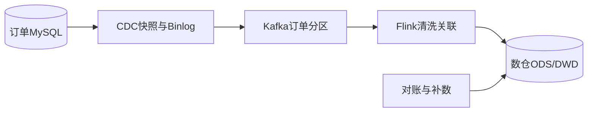

# 如何设计电商订单数据同步到数仓的方案，保证准确和高性能？

日期：2026-07-12  
标签：#面试 #八股 #后端 #数据同步 #数仓 #系统设计

## 一句话答案

以数据库 CDC 捕获订单变更，经持久消息总线和流处理转换后写入数仓明细层，通过主键版本幂等、事务边界、检查点、对账和离线重算兼顾实时性、性能与准确性。

## 面试口语版

订单库开启 binlog，CDC 读取一致快照后无缝衔接增量位点，把订单、明细、支付和退款变更写 Kafka。消息按订单 ID 分区保证单订单有序，携带 source position、操作类型、事务 ID 和 schema version。Flink 做清洗、关联和维表补充，依靠 checkpoint 恢复；目标明细表按订单主键和版本 upsert，迟到旧事件不能覆盖新状态。高吞吐通过批量、压缩、并行分区和异步 I/O 实现。准确性通过源端行数/金额与数仓按日分区对账、差异补数和全量重算兜底。

## 架构图

## 关键细节

- CDC 位点与快照必须一致，避免全量/增量之间漏数。
- 订单状态按版本或 binlog position 更新，不能只按到达时间。
- 敏感字段脱敏、加密并做访问审计。
- 数仓口径包含支付、取消和退款的时间归属规则。

## 面试官追问

1. 如何保证全量快照和增量 binlog 不重不漏？
2. 数仓写入如何幂等？
3. 如何证明订单金额同步准确？

## 面试官追问参考答案

### 1. 如何保证全量快照和增量 binlog 不重不漏？

在一致性快照对应的 binlog 位点启动：先记录位点并读取快照，同时缓存/持续读取之后增量，快照结束后按位点顺序消费。重复数据由主键版本幂等，不能分别独立启动全量和增量。

### 2. 数仓写入如何幂等？

以业务主键加源版本或 binlog 位点做 upsert，只有新版本可覆盖旧版本；批次写入携带 checkpoint/事务 ID。追加型湖表可先落不可变日志，再通过 merge/compaction 形成最新视图。

### 3. 如何证明订单金额同步准确？

按业务日、店铺、状态统计源库与数仓的订单数、金额和退款额，比较校验和并抽查明细。差异按主键生成修复任务，口径版本和截止水位必须一致。

## 学习清单

- [ ] 掌握 CDC、Kafka、Flink 和数仓分层。
- [ ] 理解版本幂等与业务对账。

