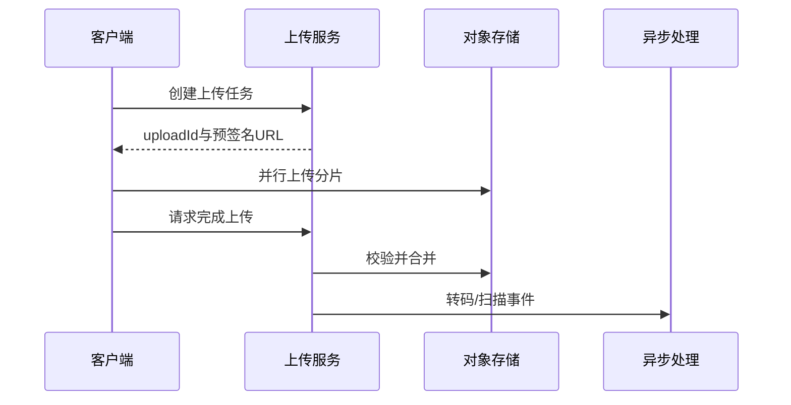

# 设计文件上传系统

日期：2026-07-11  
标签：#面试 #八股 #后端 #系统设计 #场景题

## 一句话答案

文件上传系统应让客户端通过临时凭证直传对象存储，并提供分片、断点续传、秒传、完整性校验、异步处理和安全扫描。

## 面试口语版

客户端先向业务服务申请上传任务，服务端鉴权后返回 uploadId、分片策略和对象存储预签名 URL。客户端直接把分片上传到对象存储，避免应用服务器中转大流量；完成后服务端校验分片列表、大小和哈希，合并对象并写入元数据。图片转码、视频切片、病毒扫描通过 MQ 异步完成。下载使用短期签名 URL 和 CDN，私有文件还要校验权限、防盗链并记录审计日志。

## 关键细节

- 秒传不能仅信客户端哈希，需结合租户权限，并视风险做服务端抽样或全量校验。
- 分片接口幂等，以 `uploadId + partNumber` 唯一标识。
- 未完成上传任务和孤儿分片要定期清理。
- 元数据与对象存储存在跨系统一致性问题，可使用状态机和补偿任务最终一致。

## 面试官追问

1. 如何实现断点续传？
2. 如何校验超大文件完整性？
3. 数据库成功但对象合并失败怎么办？
4. 如何防止用户上传恶意文件？

## 面试官追问参考答案

### 1. 如何实现断点续传？

服务端创建 uploadId，客户端将文件切片并用 `uploadId + partNumber` 幂等上传。恢复时查询已成功分片列表，只补传缺失分片；完成请求携带有序分片信息，服务端校验数量、大小和摘要后通知对象存储合并。

### 2. 如何校验超大文件完整性？

客户端计算整文件哈希和每片哈希，服务端或对象存储先校验分片 ETag/Checksum，合并后再校验整体摘要。不能把 multipart ETag 一律当作文件 MD5，不同对象存储算法可能不同；高安全场景使用 SHA-256 并由服务端复核。

### 3. 数据库成功但对象合并失败怎么办？

元数据先处于 `UPLOADING/MERGING` 中间态，不应直接标记可用。合并操作通过任务表或 MQ 重试，成功后条件更新为 READY；超过重试阈值转人工或失败态，并由清理任务删除孤儿分片。查询端只暴露 READY 文件。

### 4. 如何防止用户上传恶意文件？

限制大小、扩展名、MIME、压缩比和分片数量，但不能只信客户端声明。文件进入隔离区后做病毒扫描、内容识别和解压安全检查，下载时使用 `Content-Disposition`、独立域名和正确 Content-Type，私有文件还需鉴权、短期签名与审计。

