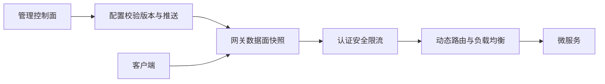

# 设计 API 网关要考虑哪些功能？如何实现动态路由和限流？

日期：2026-07-12  
标签：#面试 #八股 #后端 #API网关 #微服务 #限流 #系统设计

## 一句话答案

API 网关是统一流量入口，负责路由、认证、限流、协议转换、灰度、观测和安全；控制面管理动态配置，数据面使用不可变快照高速匹配并本地执行限流。

## 面试口语版

我会拆成控制面和数据面。控制面维护路由、服务发现、证书、限流和灰度规则，配置校验、版本化并推送；数据面用前缀树/Matcher 按 Host、Path、Method、Header 匹配路由，选服务实例并做负载均衡，配置通过原子快照热更新。请求先经过 TLS、鉴权、WAF、请求大小限制和限流，再路由到后端，响应统一错误与 Trace。限流支持全局、租户、用户、IP 和接口维度；本地令牌桶承担低延迟，集中配额或 Redis Lua 协调全局额度，异常时按业务 fail-open/close。

## 架构图

## 关键细节

- 网关不能执行长耗时业务逻辑，避免成为单点瓶颈。
- 配置错误要预检查、灰度和一键回滚。
- 多级超时和重试遵循总 Deadline，写请求不盲目重试。
- 监控 routeId、状态码、P99、拒绝数、连接池和下游异常。

## 面试官追问

1. 动态路由更新如何避免请求读到半配置？
2. 分布式限流如何保证全局配额？
3. 网关自身如何高可用？

## 面试官追问参考答案

### 1. 动态路由更新如何避免请求读到半配置？

后台构建并完整校验新不可变路由表，预热后通过 AtomicReference/volatile 原子替换版本；在途请求继续使用旧快照。配置带版本和校验和，失败不切换并保留快速回滚。

### 2. 分布式限流如何保证全局配额？

强全局可用 Redis Lua/集中限流服务原子发令牌，但增加网络依赖；高性能方案把总配额周期性分发到各网关，本地执行并回收/再平衡，允许小误差。资金接口可选择更严格方案。

### 3. 网关自身如何高可用？

无状态多实例跨故障域部署，前置负载均衡健康检查，配置保留本地快照；容量满足 N+1，滚动发布和过载保护。控制面故障不应影响数据面使用最后有效配置转发。

## 学习清单

- [ ] 能拆分控制面和数据面。
- [ ] 理解动态快照、限流和高可用。

