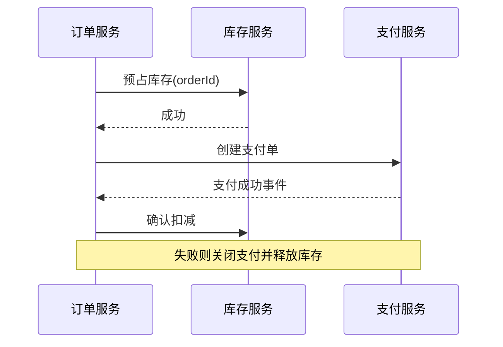

# 如何保证订单、库存、支付三个服务的数据一致性？

日期：2026-07-12  
标签：#面试 #八股 #后端 #电商 #分布式事务 #系统设计

## 一句话答案

以订单状态机编排 Saga：订单本地落单并可靠发布事件，库存幂等预占，支付创建/确认，成功后确认库存；失败或超时按状态补偿释放库存与关闭/退款支付。

## 面试口语版

我会用 Saga 编排而非跨三个库强 2PC。订单服务创建 `CREATING` 订单，并在本地事务写 Outbox；编排器调用库存服务按 orderId 幂等预占，成功后创建支付单，订单转待支付。支付回调通过可靠事件将订单改为已支付，再确认库存为已售。超时或支付失败时，订单条件更新为取消中，关闭支付单并释放预占库存；若关闭后发现已支付，则进入退款。每个步骤都有唯一业务流水、合法状态转换、重试、补偿和对账。

## Saga 流程

## 关键细节

- 库存采用预占、确认、释放三态，不能直接先扣后猜。
- 支付超时是未知，必须回查而非立即释放。
- 补偿可能失败，状态保持处理中并持续重试/人工介入。
- Outbox 保证本地事务与事件发布一致，消费者幂等。

## 面试官追问

1. 库存预占成功但支付单创建失败怎么办？
2. 支付回调和超时取消并发怎么办？
3. 为什么不使用 2PC？

## 面试官追问参考答案

### 1. 库存预占成功但支付单创建失败怎么办？

订单进入补偿中，按 orderId 幂等释放库存；支付创建若是未知状态先查询，确认未创建才补偿。补偿事件可靠重试并有超时扫描，不能只调用一次。

### 2. 支付回调和超时取消并发怎么办？

双方通过订单状态条件更新竞争；取消中先关闭/查询支付渠道，发现成功则转已支付，确认未支付才已取消。取消后迟到支付自动退款，库存释放按唯一流水幂等。

### 3. 为什么不使用 2PC？

支付第三方通常不支持 XA，长事务会锁资源、降低可用性并受协调者故障影响。电商流程本身是长事务，更适合可观察、可补偿的 Saga/TCC 和最终一致。

## 学习清单

- [ ] 能画订单、库存、支付状态机。
- [ ] 掌握 Outbox、幂等和 Saga 补偿。

