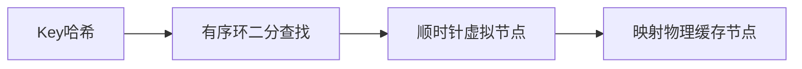

# 分布式缓存如何实现一致性 Hash？相比普通 Hash 解决什么问题？

日期：2026-07-12  
标签：#面试 #八股 #后端 #一致性Hash #分布式缓存 #负载均衡

## 一句话答案

将节点和 Key 映射到同一哈希环，Key 顺时针选择第一个节点；节点增删只影响相邻区间，虚拟节点用于改善负载均衡和支持权重。

## 面试口语版

普通 `hash(key) % N` 在 N 变化后几乎所有 Key 都重新映射，会导致缓存大面积失效。一致性 Hash 把哈希空间看成环，每个物理节点放多个虚拟节点，Key 哈希后顺时针找到第一个虚拟节点所属的物理机。新增节点只接管前驱到自身的区间，删除节点只把该区间交给后继，因此迁移比例约与变更节点容量相关。路由表用有序数组二分或 TreeMap 查找，节点列表通过版本化快照发布。

## 环形路由

## 关键细节

- 虚拟节点数量越多分布越均匀，但路由表和迁移成本增加。
- 异构节点按权重分配不同数量虚拟节点。
- 节点切换时需双读、迁移或接受缓存未命中。
- 热 Key 不会因一致性 Hash 自动拆散，仍需复制/分桶。

## 面试官追问

1. 一致性 Hash 节点增删会迁移多少数据？
2. 为什么需要虚拟节点？
3. 如何处理热点 Key？

## 面试官追问参考答案

### 1. 一致性 Hash 节点增删会迁移多少数据？

理想均匀情况下新增第 N+1 个等容量节点约接管 `1/(N+1)` 的 Key，删除一个节点约迁移其 `1/N` 区间到后继。实际比例取决于虚拟节点分布和权重。

### 2. 为什么需要虚拟节点？

物理节点少时随机哈希点容易分布不均，虚拟节点把每台机器散布到环上多个位置，使负载和迁移更平滑；还可通过虚拟节点数量表达容量权重。

### 3. 如何处理热点 Key？

对只读热点做本地缓存或多副本并随机读，写热点可分桶/分片聚合，必要时请求合并和限流。一致性 Hash 只决定单 Key 去哪，不会拆分该 Key 的流量。

## 学习清单

- [ ] 会解释 Hash 环和虚拟节点。
- [ ] 理解迁移范围与热点局限。

