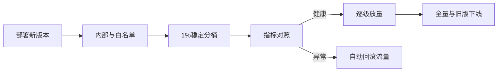

# 如何设计灰度发布系统？如何逐步切换流量？

日期：2026-07-12  
标签：#面试 #八股 #后端 #灰度发布 #系统设计 #场景题

## 一句话答案

灰度系统由版本部署、流量规则、配置控制、指标判定和自动回滚组成，按内部用户、标签、百分比逐级放量，并保持同一用户粘性和全链路版本透传。

## 面试口语版

先并行部署稳定版和新版本，实例带 version 标签。控制面配置按用户白名单、租户、区域、设备、请求 Header 或一致性 Hash 百分比的规则，网关/Service Mesh 数据面原子加载规则并路由；用 userId Hash 做稳定分桶，避免同一用户在版本间跳动。发布从内部、1%、5%、20% 到全量，每阶段观察最小窗口内的错误率、P99、资源和业务转化，与旧版做对照。越过阈值自动暂停或将规则切回旧版。异步消息、定时任务和下游调用也携带版本/实验上下文，避免只灰度入口。

## 发布流程

## 关键细节

- 灰度规则版本化、审计并可原子回滚。
- 百分比分桶用稳定身份和固定哈希，匿名用户可用设备/会话 ID。
- 长连接、缓存和消息消费要考虑版本粘性。
- 回滚前确认数据库和外部副作用向后兼容。

## 面试官追问

1. 如何保证同一用户稳定命中新版本？
2. 如何决定每阶段是否继续放量？
3. 为什么只在网关灰度可能不够？

## 面试官追问参考答案

### 1. 如何保证同一用户稳定命中新版本？

用稳定 userId/tenantId 计算一致哈希并落入固定桶，规则版本内桶范围不变；未登录用户使用长期设备或会话 ID。避免随机数每请求重新抽样。

### 2. 如何决定每阶段是否继续放量？

设定最小样本和观察时间，对比新旧版本的错误率、P99、资源、核心转化和数据差异。全部在门限内且无新增严重告警才放量，越界自动回滚并冻结发布。

### 3. 为什么只在网关灰度可能不够？

服务会产生异步消息、定时任务和内部 RPC，后续链路可能丢失版本上下文，导致新旧逻辑混用。需透传实验标签，或让新版本使用隔离 Topic/消费者和配置。

## 学习清单

- [ ] 能设计稳定分桶和逐级放量。
- [ ] 理解指标门禁与全链路灰度。

