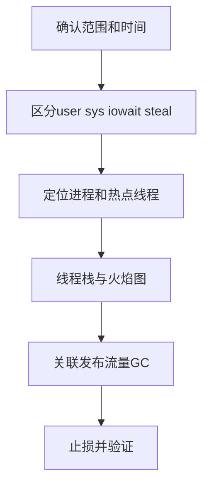

# 线上业务服务器 CPU 飙高如何排查？

日期：2026-07-11  
标签：#面试 #八股 #后端 #线上问题排查 #场景题

## 一句话答案

先确认 CPU 类型和异常进程，再定位进程内高 CPU 线程，将线程 ID 转换后关联线程栈、火焰图和业务变更，最后基于证据止损并验证恢复。

## 面试口语版

我先看监控确认是单机还是集群、从何时开始、user/sys/iowait/steal 哪项升高，并对照发布和流量变化。Linux 上用 `top` 或 `pidstat` 找进程，再用 `top -H -p PID` 找热点线程，把十进制线程 ID 转十六进制，在 `jstack` 中匹配 `nid`，判断是死循环、频繁序列化、锁自旋还是 GC 线程。必要时用 `async-profiler` 或 JFR 采样 CPU 火焰图。应急可摘流量、限流、回滚或扩容，但要先保留现场。

## 排查流程

## 关键细节

- CPU 高不等于 Load 一定高，Load 高也不等于 CPU 高。
- 如果 GC 线程占用高，要结合分配速率、堆占用和 GC 日志定位，不能只调大堆。
- `jstack` 要连续抓取多次；同一线程持续停在同一业务栈才更有证据。
- 容器环境要同时检查 CPU limit、throttling 和宿主机 steal。

## 面试官追问

1. user、sys、iowait 和 steal 分别说明什么？
2. 如何把线程 ID 与 Java 线程栈对应？
3. CPU 高但接口不慢可能是什么原因？
4. 如何安全使用 profiler？

## 面试官追问参考答案

### 1. user、sys、iowait 和 steal 分别说明什么？

user 是用户态代码消耗，sys 是内核态系统调用和中断等消耗；iowait 表示 CPU 空闲但系统有未完成 I/O，并不等于磁盘利用率；steal 是虚拟机等待宿主机分配 CPU 的时间，高时可能是宿主机争用。

### 2. 如何把线程 ID 与 Java 线程栈对应？

用 `top -H -p PID` 或 `ps -L` 找十进制线程 ID，再用 `printf '%x' TID` 转为十六进制，在 `jstack` 输出中搜索 `nid=0x...`。连续抓取数次，确认该线程持续位于相同热点栈。

### 3. CPU 高但接口不慢可能是什么原因？

可能有足够空闲核或自动扩容掩盖延迟，也可能是后台计算、GC、日志压缩等非请求线程消耗 CPU。还可能平均延迟正常但吞吐下降或 P99 已恶化，因此应同时看利用率、饱和度、吞吐、错误和尾延迟。

### 4. 如何安全使用 profiler？

优先使用采样型 async-profiler/JFR，设置较短持续时间、合理采样频率和输出大小，先在单个实例执行并避开峰值。确认工具与 JDK 兼容，保留资源监控和停止手段，结果包含敏感方法参数时要按安全要求处理。

## 学习清单

- [ ] 熟悉 `top`、`pidstat`、`jstack`、JFR 的使用顺序。
- [ ] 能区分业务计算、GC、内核和虚拟化问题。

