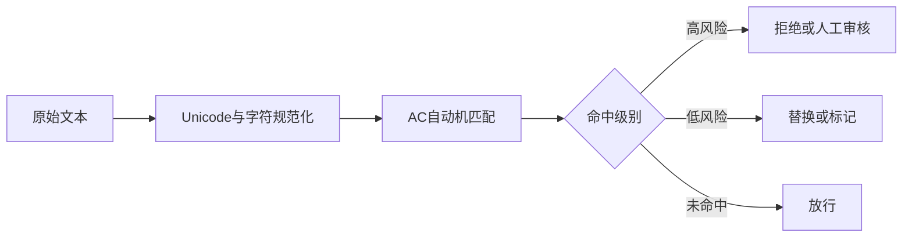

# 如何实现敏感词过滤功能？

日期：2026-07-11  
标签：#面试 #八股 #后端 #算法 #系统设计 #场景题

## 一句话答案

先规范化输入，再用 Trie 或 Aho-Corasick 自动机进行多模式匹配，并配合词库版本管理、白名单、审计和人工复核处理误杀与对抗变体。

## 面试口语版

如果词库较小，可以用 Trie，从文本每个位置向后匹配；词库大且需要一次扫描匹配多个词时，用 AC 自动机更合适，复杂度接近文本长度加命中数。匹配前要统一大小写、全半角、Unicode、繁简体和特殊符号，防止插空格、同音字或变体绕过。结果可以按场景拒绝、替换、打标签或进入人工审核。词库要支持分级、白名单、热更新、版本回滚和命中审计。

## 流程图

## 关键细节

- 词库更新可构建新自动机后原子替换引用，避免更新期间读到半成品。
- 规范化必须保留原文位置映射，才能准确高亮或替换原文本。
- 纯关键词无法理解上下文，重要内容应结合模型审核与人工复核。
- 注意误杀、隐私、合规和申诉流程，不能把词库直接暴露给客户端。

## 面试官追问

1. Trie 和 AC 自动机复杂度分别是多少？
2. 如何无停机更新千万级词库？
3. 如何处理“法轮-功”一类插入字符的绕过？
4. 如何降低误杀率？

## 面试官追问参考答案

### 1. Trie 和 AC 自动机复杂度分别是多少？

Trie 对文本每个起点向后匹配，最坏可到 O(n·L)，L 是最长词长；AC 自动机构建后一次扫描文本，匹配复杂度约 O(n + z)，z 是命中数量，构建复杂度与词库总字符数和字符集处理有关。

### 2. 如何无停机更新千万级词库？

在后台基于新版本构建完整自动机并校验、预热，完成后通过原子引用切换，读请求始终使用不可变旧版或新版。多实例通过版本号和配置中心协调，保留旧版本一段时间以支持回滚，避免原地修改共享结构。

### 3. 如何处理插入字符的绕过？

匹配前做 Unicode 规范化、大小写/全半角统一，并按规则移除或折叠空格、标点和零宽字符；同时保留规范化字符到原文位置的映射。更复杂的同音字、形近字可用变体词典或模型补充，但会提高误杀率。

### 4. 如何降低误杀率？

词库按风险和上下文分类，加入白名单、词边界和领域规则，高风险阻断、低置信度进入人工审核。持续抽样命中结果，依据申诉和标注数据评估准确率/召回率，并支持按版本快速回滚。

## 学习清单

- [ ] 理解 Trie、失败指针和 AC 自动机匹配流程。
- [ ] 能说明输入规范化与原始位置映射。

