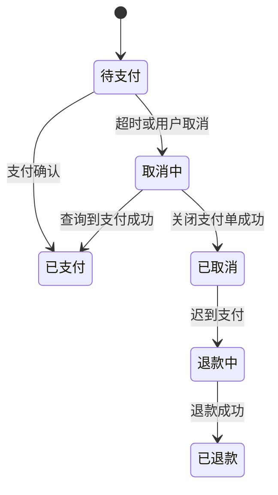

# 订单取消的那一刻用户刚好付款，怎么办？

日期：2026-07-11  
标签：#面试 #八股 #后端 #订单 #支付 #场景题

## 一句话答案

通过订单状态机、数据库条件更新和支付回查协调取消与支付竞态；最终若订单已取消但支付成功，应幂等发起退款并完成对账补偿。

## 面试口语版

取消和支付回调不能直接覆盖状态，而要执行条件状态转换。例如取消只能把“待支付”改为“取消中”，支付回调只能把“待支付或取消中”改为“已支付”，具体优先级由业务决定。取消前先向支付渠道查询或关闭支付单：关闭成功再把订单置为已取消；若关闭失败或发现已支付，就进入已支付流程。由于查询和回调仍有竞态，最终兜底是发现“已取消但渠道已支付”时自动退款。所有回调、关闭和退款都必须幂等，并靠对账任务修复漏单。

## 状态流转

## 关键细节

- 使用 `UPDATE ... WHERE status IN (...)` 的受影响行数判断是否抢到状态转换权。
- 支付回调可能重复、乱序或延迟，业务流水号必须唯一。
- “本地已取消”不等于“支付渠道已关闭”，两边状态必须核对。
- 定时任务主动查询支付渠道，并进行日终账单对账。

## 面试官追问

1. 取消和回调同时更新数据库，谁应该优先？
2. 自动退款失败怎么办？
3. 如何设计支付回调幂等？
4. 库存什么时候释放？

## 面试官追问参考答案

### 1. 取消和回调同时更新数据库，谁应该优先？

没有脱离业务的唯一答案，关键是用状态机定义优先级并原子执行。通常真实支付成功优先：取消先进入取消中并关闭渠道，若渠道已支付则转已支付；只有确认关闭成功才能已取消，迟到成功则退款。

### 2. 自动退款失败怎么办？

退款状态保持退款中，按退款业务号幂等重试并主动查询渠道状态，指数退避且有最大自动重试窗口。持续失败进入告警和人工工单，资金对账每天扫描，不能把请求受理成功误当成渠道退款成功。

### 3. 如何设计支付回调幂等？

先验签并核对商户、订单、金额和币种，以渠道交易号/业务支付单号建立唯一约束。订单用条件更新只允许合法状态迁移，重复回调返回成功但不重复入账、发货或发消息；业务副作用也需各自使用唯一流水。

### 4. 库存什么时候释放？

只有订单从待支付/取消中成功转换为已取消并确认支付渠道未成功后才释放。释放操作携带订单库存流水号保证幂等；若支付先确认则不释放，若释放后发现迟到支付则退款而不是再次抢占可能已售出的库存。

## 学习清单

- [ ] 画出订单与支付状态机。
- [ ] 能解释条件更新、幂等、回查和对账四道保障。

