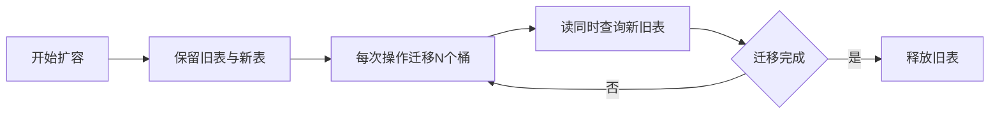

# 1G HashMap 在用户请求时触发扩容会怎样，如何优化？

日期：2026-07-11  
标签：#面试 #八股 #后端 #HashMap #性能优化 #场景题

## 一句话答案

大 HashMap 扩容会分配更大的桶数组并迁移大量节点，造成延迟尖刺、额外内存峰值和 GC 压力；应通过准确预估容量、分片、渐进式迁移或换用专用存储规避请求线程一次性扩容。

## 面试口语版

1G HashMap 扩容时，首先要申请约两倍容量的新桶数组，然后遍历旧桶迁移节点。扩容由当前 `put` 请求同步承担，可能出现长尾延迟；旧表和新表短时间共存，还会抬高内存峰值，甚至触发 Full GC 或 OOM。最直接的优化是初始化时根据预计元素数和负载因子设置容量，避免运行中扩容。更通用的改造是分片 Map，每片独立扩容，或者维护新旧两张表，每次普通操作帮助迁移少量桶，完成渐进式 rehash。

## 渐进式扩容思路

## 关键细节

- 初始容量应约为 `ceil(expectedSize / loadFactor)`，再取不小于它的 2 的幂。
- 渐进扩容期间，写入优先落新表，读取按迁移状态查一张或两张表。
- 并发版本还要处理桶迁移标记、重复迁移、内存可见性和线程协助扩容。
- 1G 常驻 Map 可能本身就是架构信号：可考虑 Caffeine 分层缓存、堆外存储或 Redis。

## 面试官追问

1. JDK 8 扩容为什么不需要重新计算完整 hash？
2. 渐进式 rehash 时如何查询？
3. 预估容量为什么仍可能 OOM？
4. 堆外存储有哪些代价？

## 面试官追问参考答案

### 1. JDK 8 扩容为什么不需要重新计算完整 hash？

容量从 n 变 2n 后，新掩码只比旧掩码多一位，即 `hash & n`。该位为 0 的节点索引不变，为 1 的节点移动到 `oldIndex + n`，所以可把旧链拆成 low/high 两链，无需重新调用 hash 扰动。

### 2. 渐进式 rehash 时如何查询？

维护旧表、新表和迁移游标。未迁移桶从旧表查，已迁移桶从新表查；简单实现也可先查新表再查旧表。写入统一落新表，并在每次操作中迁移固定数量桶，桶迁移状态必须原子发布。

### 3. 预估容量为什么仍可能 OOM？

估算可能忽略节点对象头、引用、对齐、Key/Value、树节点和临时对象；预分配巨型数组本身需要连续地址和清零，扩容时新旧表共存。JVM 堆还要给其他业务、GC 预留空间，容器 limit 也可能小于配置堆。

### 4. 堆外存储有哪些代价？

减少 GC 扫描并支持更紧凑布局，但需要手动生命周期管理、序列化和边界检查，访问可能更慢且调试困难。内存泄漏不会被 GC 自动回收，崩溃恢复、并发控制和监控都要自行设计。

## 学习清单

- [ ] 能说明扩容的 CPU、内存和 GC 三类风险。
- [ ] 理解预分配、分片和渐进 rehash。

