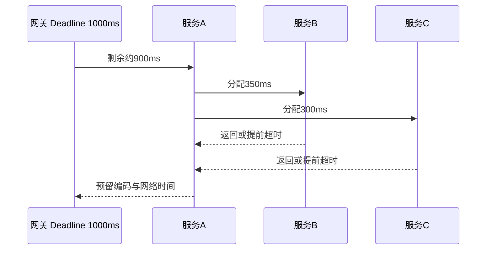

# 从网关到各后端服务，如何设置 RPC 超时时间？

日期：2026-07-11  
标签：#面试 #八股 #后端 #网关 #RPC #系统设计 #场景题

## 一句话答案

以用户请求的绝对 Deadline 为总预算，沿调用链递减传播；串行调用分配时间片，并行调用受最慢必要分支约束，同时为重试、排队和返回预留余量。

## 面试口语版

网关先根据接口 SLO 设置总 Deadline，例如 1 秒，并把截止时间随 Trace Context 或 RPC 元数据传下去。每个服务收到请求后先计算剩余时间，再扣除自身计算和返回余量，为下游设置更短超时。串行链路的预算相加，不能每一跳都设 1 秒；并行调用则看关键分支的最大耗时，但应取消超时后的其他任务。还要把网关、负载均衡、RPC 客户端和服务端超时顺序配置好，通常越靠内层越早超时，才能返回明确错误并释放资源。

## 超时传播

## 关键细节

- 超时包含排队、连接池等待、DNS、建连、传输和服务执行，不能只看业务代码耗时。
- 服务端应感知取消信号，停止无意义工作；数据库驱动也要设置查询超时。
- Fan-out 调用越多，整体尾延迟越容易变差，需要并发上限、部分结果或降级方案。
- 网关超时应略大于内层总预算，否则网关先断开而下游仍在执行。

## 面试官追问

1. 串行和并行调用如何分别计算预算？
2. 如何让下游感知请求已取消？
3. Fan-out 一百个服务会带来什么问题？
4. 重试应该在哪一层做？

## 面试官追问参考答案

### 1. 串行和并行调用如何分别计算预算？

串行链路各步骤的最坏预算近似相加，还要预留网关、排队和返回时间；并行分支整体等待时间接近关键必要分支的最大值，但每个分支仍受相同剩余 Deadline 限制。非必要分支应设更短预算或允许降级。

### 2. 如何让下游感知请求已取消？

通过 RPC Context 传递绝对 Deadline 和 Cancellation Token，连接断开或上游取消时触发信号。下游在排队、循环、异步任务和数据库查询处检查取消，并调用驱动的 cancel；不能只在入口检查一次。

### 3. Fan-out 一百个服务会带来什么问题？

整体成功率是各分支成功率的组合，尾延迟取最大值，连接、线程和流量也被放大，单个慢分支就可能拖累请求。应减少同步依赖、批量化、限制并发、缓存或预计算，并支持部分结果和快速失败。

### 4. 重试应该在哪一层做？

尽量由最了解错误语义且能保证幂等的一层做一次有限重试，通常是直接 RPC 客户端。网关不应盲目重试所有写请求，服务链每层也不能各自重试；重试必须遵守总 Deadline、退避和全局预算。

## 学习清单

- [ ] 能画出 Deadline 逐层递减示意图。
- [ ] 能解释超时、取消、重试和熔断的配合。

