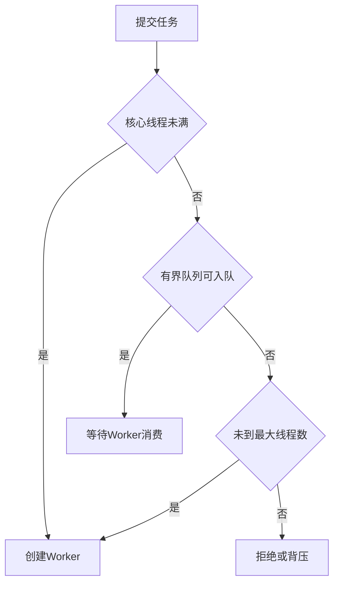

# 让你设计一个线程池，怎么设计？

日期：2026-07-11  
标签：#面试 #八股 #后端 #Java并发 #系统设计 #场景题

## 一句话答案

线程池由任务队列、工作线程集合、生命周期状态和拒绝策略组成，核心目标是复用线程并通过有界并发和背压保护系统，而不是无限提高吞吐。

## 面试口语版

提交任务时，如果运行线程少于核心线程数就创建 Worker；否则进入有界队列；队列满且未达到最大线程数时再创建临时 Worker；如果仍无法接收，则执行拒绝策略。Worker 循环从队列取任务执行，空闲超过 keepAlive 的非核心线程退出。线程池还要支持 shutdown、shutdownNow、任务异常隔离、线程工厂、统计指标和上下文清理。队列必须有界，否则突发流量会把延迟和内存风险隐藏成无限积压。

## 核心流程

## 关键细节

- CPU 密集型线程数通常接近可用核数；I/O 密集型可更高，但应通过压测和等待/计算比例估算。
- 任务抛异常不能导致 Worker 状态和统计失真；使用后要清理 ThreadLocal、MDC 等上下文。
- `CallerRunsPolicy` 能形成一定背压，但若调用线程不能阻塞则需选择快速失败或降级。
- 不同延迟和资源特征的任务应使用隔离线程池，避免一个慢依赖拖死全部业务。
- 实现层面需通过原子状态管理线程池运行状态与 Worker 数量，避免关闭和提交竞态。

## 面试官追问

1. 为什么先入队再扩到最大线程数？
2. 如何确定核心线程数和队列长度？
3. `shutdown` 与 `shutdownNow` 有什么区别？
4. 如何实现定时任务线程池？
5. 如何避免任务饥饿？

## 面试官追问参考答案

### 1. 为什么先入队再扩到最大线程数？

ThreadPoolExecutor 的策略让达到核心线程数后优先排队，避免轻微突发就创建大量线程，控制上下文切换和资源占用；队列满才扩到最大线程数以应对压力。若使用 SynchronousQueue，则无法排队，会更积极地创建线程。

### 2. 如何确定核心线程数和队列长度？

CPU 密集任务从可用核数附近开始，I/O 密集可按 `核数 × (1 + 等待/计算时间)` 粗估，再用压测校准。队列长度依据允许排队延迟和处理吞吐，用 Little's Law 辅助估算，并必须在内存和下游容量范围内。

### 3. `shutdown` 与 `shutdownNow` 有什么区别？

`shutdown` 停止接收新任务，但继续执行队列和在途任务；`shutdownNow` 尝试中断正在执行的线程并返回尚未开始的队列任务。中断是协作机制，任务若忽略中断不保证立即停止，资源释放仍要在 finally 中完成。

### 4. 如何实现定时任务线程池？

用按触发时间排序的延迟队列，Worker 获取到期任务执行；周期任务执行后根据固定频率或固定延迟计算下一次触发并重新入队。需处理系统时钟、任务异常、长任务重叠、取消和关闭语义，Java 可参考 ScheduledThreadPoolExecutor。

### 5. 如何避免任务饥饿？

避免无限优先级队列和长期占用线程的任务，将长短任务、不同租户和不同优先级分池或做配额；使用老化策略逐步提高等待任务优先级。阻塞任务应可中断并设置超时，持续监控最大等待时间。

## 学习清单

- [ ] 掌握 ThreadPoolExecutor 的任务接收顺序。
- [ ] 能从容量和背压角度解释参数，而非背公式。

