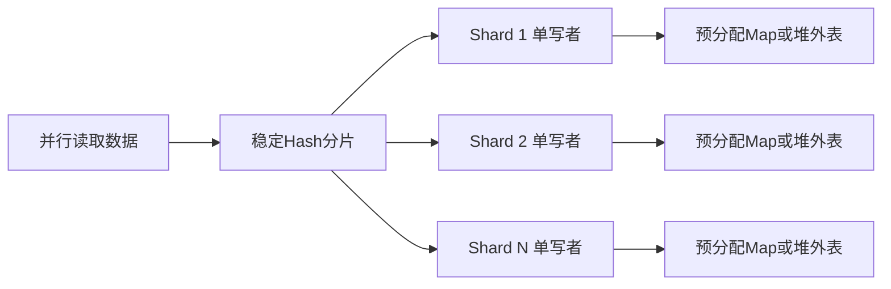

# 没有内存限制，如何快速、安全地将 1000 亿条数据插入 HashMap？

日期：2026-07-11  
标签：#面试 #八股 #后端 #HashMap #Java集合 #场景题

## 一句话答案

“没有内存限制”不代表单个 Java HashMap 可承载千亿元素；应先澄清一致性与数据来源，再按哈希分片并行写入多个预分配、单写者分区，必要时采用堆外或分布式 KV 存储。

## 面试口语版

我不会直接创建一个超大 HashMap。Java 数组下标和单对象大小、GC 停顿、扩容峰值以及进程故障恢复都会成为瓶颈。设计上先对 Key 做稳定哈希，分成大量 Shard，每个分片由固定线程单写，这样分片内部可使用普通 HashMap，无需锁；生产线程把数据批量投递到对应分片队列。每个 Map 根据预估数据量一次性设置容量，避免扩容。若单机地址空间、GC 或恢复时间不可接受，就使用堆外分段哈希或分布式 KV，并做检查点和校验。

## 推荐架构

## 关键细节

- “安全”需明确是线程安全、数据不丢、去重正确还是机器宕机可恢复，不同目标方案不同。
- 1000 亿对象的对象头、引用和节点开销极大，实际空间远超 Key/Value 原始字节数；应使用紧凑数据布局。
- 分片单写避免全局锁，读取可在装载完成后发布不可变快照；边写边读则需明确一致性语义。
- 预分配也可能造成巨型数组和长时间清零，可按段懒分配。
- 需要持久化时，HashMap 不是合适的最终存储，应考虑 RocksDB、分布式 KV 或专用哈希文件。

## 面试官追问

1. 为什么单个 HashMap 无法方便地容纳千亿条？
2. 分片数量如何选择？
3. 如何估算每条 Entry 的真实内存？
4. 写入中途宕机如何恢复？
5. 如何保证装载完成后的安全发布？

## 面试官追问参考答案

### 1. 为什么单个 HashMap 无法方便地容纳千亿条？

桶数组受 Java 数组索引和单对象大小限制，节点、引用和对象头导致实际内存巨大；单堆还会面临 GC、扩容峰值、启动装载和故障恢复时间。即使物理内存足够，单进程也难满足可用性和运维要求。

### 2. 分片数量如何选择？

根据每片目标元素数、可接受扩容/恢复时间、并行线程数和未来增长选择，并留足容量。分片应远多于机器数以便再平衡，但过多会增加元数据和文件开销；使用稳定哈希或固定虚拟分片避免扩容时全量重排。

### 3. 如何估算每条 Entry 的真实内存？

统计节点对象头、hash、key/value 引用、next 引用、对象对齐，以及 Key/Value 自身对象和桶数组摊销。可用 JOL 验证对象布局，并在接近真实数据分布下实际装载采样 RSS/堆占用，不能只相加字段业务字节。

### 4. 写入中途宕机如何恢复？

输入按确定分区切块，每块完成后写 checkpoint、条数和校验和；目标使用持久化日志、内存映射文件或可重放的源。重启后只重放未确认分块，插入按 Key 天然覆盖或使用幂等批次号，完成后做全量计数和校验。

### 5. 如何保证装载完成后的安全发布？

构建阶段不向读线程暴露可变 Map，完成校验后通过 volatile/AtomicReference 一次性发布不可变分片集合，建立 happens-before。分布式场景先生成带版本的数据集，所有分片就绪后原子切换版本指针，旧版本延迟回收。

## 学习清单

- [ ] 能从数组上限、对象开销、GC 和恢复四个角度质疑题设。
- [ ] 掌握预分配、分片单写、堆外和分布式方案的权衡。

