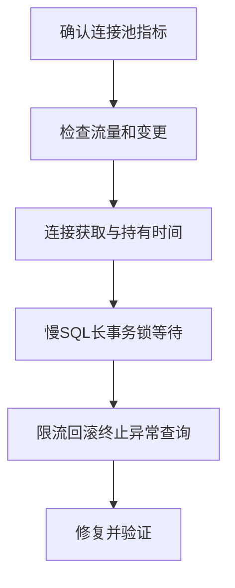

# 线上数据库连接池爆满问题排查

日期：2026-07-11  
标签：#面试 #八股 #后端 #数据库 #线上问题排查

## 一句话答案

连接池爆满通常是连接使用时间变长或请求量超过数据库承载，排查应区分慢 SQL、长事务、连接泄漏、数据库阻塞和流量突增，不能直接扩大连接池。

## 面试口语版

我先确认是单实例还是全局、活跃连接满还是等待队列满，并对齐流量、发布和数据库指标。应用侧看连接获取耗时、持有时长、超时、泄漏检测和线程栈；数据库侧看活动会话、慢 SQL、锁等待、长事务、CPU 和 I/O。应急可限流、降级、回滚、终止明确异常的长查询，必要时小幅扩池；根治是优化慢 SQL、缩短事务、修复连接未关闭、隔离批任务，并按数据库实际容量设置有界连接数。

## 排查流程

## 关键细节

- 池满是结果，先看连接为何归还变慢。
- 数据库最大连接数不是越大越好，过多并发会加剧锁和上下文切换。
- 连接泄漏检测只提供线索，阈值过短会误报正常长事务。
- 同时监控池大小、活跃数、等待数、获取 P99、持有 P99 和超时次数。

## 面试官追问

1. 如何判断是连接泄漏还是慢 SQL？
2. 为什么不能直接把连接池扩大十倍？
3. 如何给连接池设置合理大小？

## 面试官追问参考答案

### 1. 如何判断是连接泄漏还是慢 SQL？

泄漏通常表现为活跃连接长期不下降，泄漏日志或线程栈显示连接借出后没有关闭；慢 SQL 则能在数据库活动会话、慢日志和 Trace 中看到查询长时间执行。还应核对事务是否因外部 RPC 或业务等待而长期占用连接。

### 2. 为什么不能直接把连接池扩大十倍？

数据库 CPU、I/O 和锁承载不变，更多连接只会让更多查询同时竞争，延迟可能更高并拖垮其他应用。扩池还会增加数据库内存和线程开销；应先消除慢查询与泄漏，再按容量有限调整。

### 3. 如何给连接池设置合理大小？

根据数据库可分配连接总数、应用实例数、SQL 延迟和目标吞吐初算，再压测校准。所有实例最大连接之和必须小于数据库安全上限并留运维余量；设置较短获取超时和有界等待，过载时快速失败或降级。

## 学习清单

- [ ] 会联合分析应用连接池和数据库会话。
- [ ] 能说明池大小、获取超时和数据库容量的关系。

