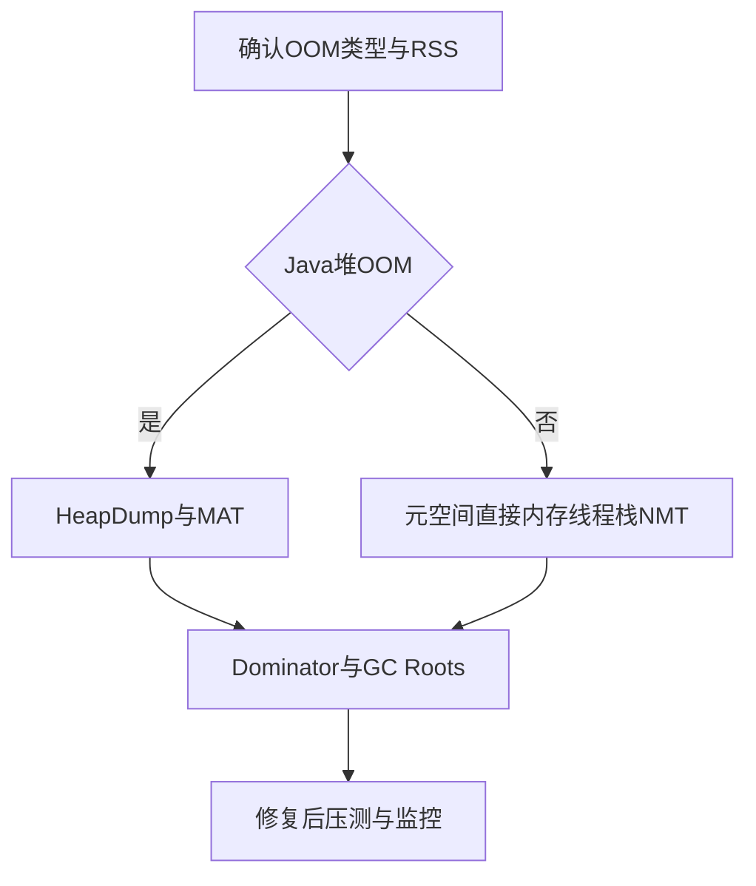

# 怎么分析 JVM 当前内存占用？OOM 后怎么分析？

日期：2026-07-11  
标签：#面试 #八股 #后端 #JVM #线上问题排查

## 一句话答案

先区分 Java 堆、元空间、直接内存、线程栈和本地内存，再结合 GC、类直方图、NMT、线程数与堆转储定位；OOM 类型不同，分析工具和根因也不同。

## 面试口语版

在线分析先看进程 RSS、容器 limit、堆已用/提交、GC 次数和停顿，再用 `jcmd VM.native_memory`、`GC.heap_info`、`GC.class_histogram`、JFR 等区分堆和非堆。OOM 前应配置 `HeapDumpOnOutOfMemoryError` 和 dump 路径，并确保磁盘足够。拿到 heap dump 后用 MAT 看 Leak Suspects、Dominator Tree、Retained Size 和到 GC Roots 的引用链。若是 Direct buffer、Metaspace、unable to create native thread 或容器被 OOMKilled，则分别查直接内存、类加载、线程数/栈和 cgroup，而不是只分析堆。

## 分析路径

## 关键细节

- Shallow Size 是对象自身，Retained Size 是该对象被回收后可释放的总量。
- dump 可能暂停进程并占用大量磁盘，生产需提前规划。
- RSS 大于 Xmx 很正常，JVM 还使用元空间、Code Cache、线程栈和直接内存。
- OOM 后先保留现场，重启只是止损，不是根因修复。

## 面试官追问

1. Heap Dump 中如何判断内存泄漏？
2. 进程 RSS 很高但堆不高怎么排查？
3. `unable to create native thread` 怎么处理？

## 面试官追问参考答案

### 1. Heap Dump 中如何判断内存泄漏？

看某类实例数量和 Retained Size 是否异常，再沿 Path to GC Roots 找出不应长期持有它的引用，例如静态 Map、ThreadLocal、监听器或无界缓存。大对象不一定是泄漏，还要结合业务预期和多次 dump 的增长趋势。

### 2. 进程 RSS 很高但堆不高怎么排查？

用 NMT 分解线程栈、Class、Code、GC、Arena 和 Internal，检查 DirectByteBuffer、mmap、JNI/native 库和线程数量；同时查看容器页缓存与共享内存。若未提前开启 NMT，可结合 `/proc`、pmap 和 JFR 缩小范围。

### 3. `unable to create native thread` 怎么处理？

检查线程数、每线程栈 `-Xss`、进程/用户线程限制、PID 限制和剩余本地内存。根治无限创建线程、无界线程池或线程泄漏；谨慎减小 Xss 或堆，为本地线程栈留空间，不能只提高系统上限。

## 学习清单

- [ ] 能区分不同 OOM 类型。
- [ ] 会解释 Dominator Tree、Retained Size 和 GC Roots。

