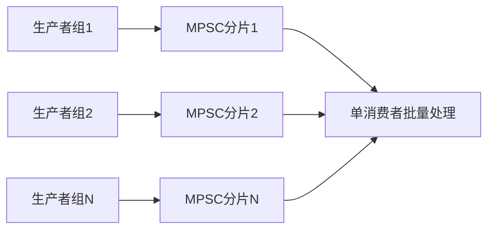

# 两百万个生产者发送消息，仅一个消费者，如何高效设计锁？

日期：2026-07-11  
标签：#面试 #八股 #后端 #并发 #队列 #场景题

## 一句话答案

这应设计为 MPSC 有界队列，而不是让两百万线程竞争一把锁；生产者通过原子序号领取槽位，单消费者顺序读取，并用分段、批量和背压控制竞争。

## 面试口语版

我会先质疑“两百万生产者”是否指两百万线程，如果是，线程模型本身不可行，应由少量 I/O EventLoop 接收连接。队列采用多生产者单消费者环形缓冲区：生产者用 CAS 获取递增 sequence，等待对应槽位可用后发布消息；消费者只有一个，可以无锁顺序推进 read sequence。为避免一个全局 CAS 成热点，可以在入口分片成多个 MPSC 队列，消费者轮询或批量归并。队列必须有界，满时阻塞、快速失败或落盘，不能无限堆积。

## 核心结构

## 关键细节

- 槽位发布需保证消息内容写入先于可见标记，使用 release/acquire 语义。
- 对 head/tail 和槽位序号做缓存行填充，降低伪共享。
- 单消费者吞吐是系统上限，必要时按 Key 分区增加消费者。
- CAS 自旋要有上限，队列满时执行明确背压。

## 面试官追问

1. 为什么普通 ConcurrentLinkedQueue 不一定够？
2. 环形队列如何防止覆盖未消费数据？
3. 单消费者处理不过来怎么办？

## 面试官追问参考答案

### 1. 为什么普通 ConcurrentLinkedQueue 不一定够？

它通用且无界，会产生节点分配、GC 和指针跳转，两百万生产源下全局尾节点 CAS 也可能竞争。专用有界 MPSC 环形队列内存连续、少分配且有背压，但实现复杂，应优先使用成熟库。

### 2. 环形队列如何防止覆盖未消费数据？

每个槽位维护 sequence/generation。生产者只有确认槽位序号表示已被消费者释放后才能写入，写完再发布下一代序号；消费者读取已发布代后将槽位标为可复用，避免仅凭取模覆盖。

### 3. 单消费者处理不过来怎么办？

先批量处理、减少单条 I/O 和优化消费者；若仍不足，按业务 Key 分区为多个队列与消费者，保证分区内有序。无法扩消费且输入持续超载时必须限流、丢弃低优先级或持久化积压。

## 学习清单

- [ ] 理解 MPSC、环形缓冲和内存可见性。
- [ ] 能说明分片与背压方案。

