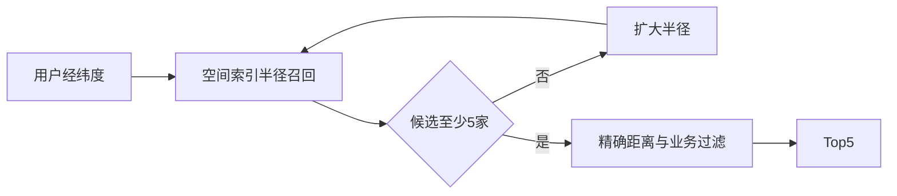

# 如何在附近 100 万商户中快速找到最近的 5 家？

日期：2026-07-11  
标签：#面试 #八股 #后端 #地理位置 #系统设计 #场景题

## 一句话答案

使用地理空间索引先按空间网格快速召回附近候选，再计算精确球面距离并取 Top 5；可选 Redis GEO、MySQL Spatial、PostGIS 或 Elasticsearch geo_distance。

## 面试口语版

不能遍历一百万商户逐个算距离。写入时保存经纬度并建立空间索引，查询以用户位置和初始半径做附近检索，若不足 5 家就逐步扩大半径；召回候选后用 Haversine 或数据库地理函数计算精确距离，按距离排序取 5。Redis GEO 适合高并发、结构简单的附近查询，PostGIS/Elasticsearch 适合叠加营业状态、品类、评分等复杂过滤。数据按城市或区域分片，位置变更异步更新索引。

## 查询流程

## 关键细节

- 经纬度不是平面坐标，大范围距离要使用球面模型。
- 先做营业、权限等过滤还是先召回，要平衡索引能力和候选数量。
- GeoHash 边界附近需查询相邻网格，不能只看当前格。
- 缓存热门区域结果时要考虑用户精确位置和过滤条件。

## 面试官追问

1. GeoHash 为什么要查询相邻格子？
2. Redis GEO 能保证返回精确最近的 5 家吗？
3. 跨城市边界如何分片查询？

## 面试官追问参考答案

### 1. GeoHash 为什么要查询相邻格子？

两个地理位置可能距离很近却位于网格边界两侧，只查当前格会漏掉真正最近的商户。因此需要同时查询相邻网格，召回后再按精确距离过滤排序。

### 2. Redis GEO 能保证返回精确最近的 5 家吗？

Redis GEO 使用地理编码索引召回并返回距离排序，工程上精度通常足够，但受球面近似和坐标精度影响。对强精度需求应扩大候选集，再在应用或专业 GIS 中用明确距离模型精排。

### 3. 跨城市边界如何分片查询？

根据查询圆与分片边界相交情况，同时请求当前城市及邻接分片，各自返回局部 Top K，聚合层计算统一距离并做全局 Top 5。分片路由元数据要覆盖边界和海量空区域。

## 学习清单

- [ ] 理解空间索引召回加精确计算。
- [ ] 能比较 Redis GEO、PostGIS 和 Elasticsearch。

