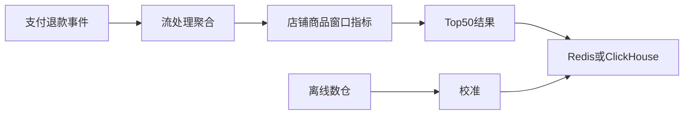

# 商家如何查看店铺卖得最好的 Top 50 商品？

日期：2026-07-11  
标签：#面试 #八股 #后端 #系统设计 #TopN #场景题

## 一句话答案

按明确统计口径消费订单事件，实时需求用流处理维护店铺窗口聚合和 Top N，离线报表用数仓聚合；退款和取消通过可撤回事件修正。

## 面试口语版

先确认“卖得最好”按销量、销售额还是支付订单数，以及时间范围和是否扣除退款。订单支付、退款、取消形成事件进入 Kafka，Flink 按 `shopId + productId + window` 聚合指标，并为每个 shop 维护 Top 50，结果写 Redis/ClickHouse。页面按店铺和窗口直接查询。日榜、月榜可由数仓重算校准，实时榜允许秒级延迟。若规模较小，也可在 MySQL 建日聚合表，通过索引查询 Top 50，不能每次扫描订单明细。

## 数据流

## 关键细节

- 退款用负向增量或更新流，事件必须去重。
- Top N 可用小顶堆，但持续更新场景更适合状态化流处理或有序集合。
- 按店铺 Key 可能数据倾斜，超级店铺需二阶段聚合。
- 结果标注统计截止时间和口径版本。

## 面试官追问

1. 退款后排行榜如何修正？
2. 超级店铺导致数据倾斜怎么办？
3. Redis ZSet 能直接解决所有 Top N 吗？

## 面试官追问参考答案

### 1. 退款后排行榜如何修正？

退款事件携带原订单明细和唯一事件 ID，对对应商品指标做负向更新，流处理去重并更新 Top N。跨窗口退款需按业务口径决定回溯原窗口还是计入当前调整，并由离线重算校准。

### 2. 超级店铺导致数据倾斜怎么办？

先按 `shopId + productId + salt` 做局部聚合，再按真实店铺和商品合并，降低单分区压力；热门店铺可独立资源组和更多并行度。最终 Top N 在合并后的商品指标上计算。

### 3. Redis ZSet 能直接解决所有 Top N 吗？

ZSet 适合单个时间窗口的增量分数和 Top N 查询，但海量店铺、多时间窗口会产生大量 Key，退款幂等、历史重算和复杂口径也不擅长。它适合结果层或中小规模聚合，不替代可靠事件和数仓。

## 学习清单

- [ ] 先明确 Top N 的统计口径。
- [ ] 理解实时聚合、退款修正和离线校准。

