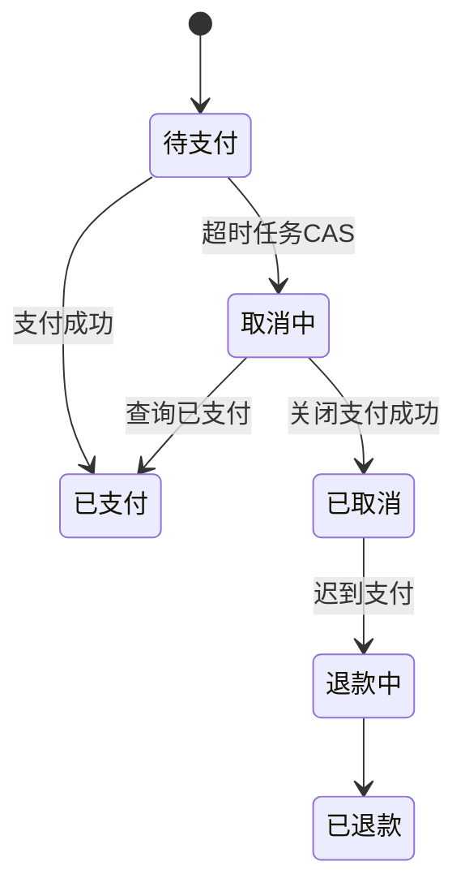

# 如何实现订单超时取消功能？

日期：2026-07-11  
标签：#面试 #八股 #后端 #系统设计 #订单 #场景题

## 一句话答案

以订单 `expire_time` 和状态机为事实，使用延迟消息或时间轮及时触发取消，数据库分片扫描兜底；取消、支付和库存回补都通过条件更新与业务流水保证幂等。

## 面试口语版

创建待支付订单时写入过期时间，并发送一条延迟消息。消息到期后消费者先查询订单，只有 `status=UNPAID` 且确实过期，才能用条件更新改为取消中，再关闭第三方支付单；关闭成功后转已取消并通过唯一库存流水释放库存。如果支付回调先把订单改为已支付，取消条件更新失败；如果取消后出现迟到支付，则自动退款。延迟消息可能丢失或延迟，所以还要按 `expire_time` 索引分片扫描漏单，日终对账最终校准。

## 状态流程

## 关键细节

- 延迟消息是触发器，数据库状态与 expire_time 才是事实。
- 关单、释放库存、退优惠券都需独立幂等流水。
- 扫描使用 `(status, expire_time, id)` 索引和游标分页，避免全表扫。
- 时间误差、消息重复和服务重启均不能改变最终状态正确性。

## 面试官追问

1. 延迟消息丢失怎么办？
2. 超时取消与支付回调并发怎么办？
3. 库存释放成功但订单状态更新失败怎么办？

## 面试官追问参考答案

### 1. 延迟消息丢失怎么办？

定时任务按过期索引扫描仍处于待支付的订单并补发/直接执行关单，支付渠道和本地订单还要定期对账。延迟 MQ 提供及时性，数据库扫描负责可靠性。

### 2. 超时取消与支付回调并发怎么办？

双方都通过合法状态条件更新竞争。取消先进入取消中后必须查询/关闭支付单；若渠道已支付则转已支付，只有确认未支付才能已取消。迟到支付进入退款，不重新占库存。

### 3. 库存释放成功但订单状态更新失败怎么办？

更合理的顺序是先在订单本地事务中确认取消并写出库存释放事件，再由消费者幂等释放。若跨服务调用，使用 Outbox/Saga 和唯一库存流水，重试及对账保证最终一致，避免同步调用跨系统假事务。

## 学习清单

- [ ] 能画出订单超时状态机。
- [ ] 理解延迟触发、扫描兜底和对账。

