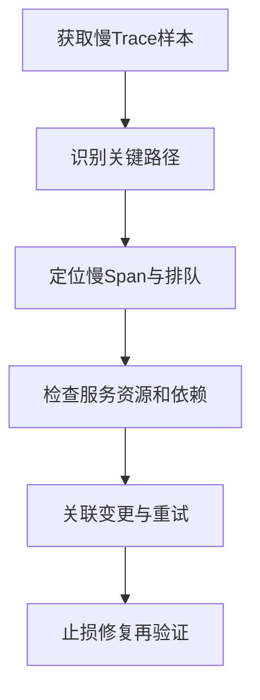

# 横跨十几个分布式服务的慢请求如何排查？

日期：2026-07-11  
标签：#面试 #八股 #后端 #分布式追踪 #线上问题排查

## 一句话答案

用统一 Trace/Request ID 还原关键路径，先找耗时最长和并行等待最慢的 Span，再结合各服务资源、排队、重试和变更定位根因，并按端到端 Deadline 止损。

## 面试口语版

先确认慢请求样本、P99 和开始时间，通过 OpenTelemetry 等追踪查看整棵调用树。串行链路看各 Span 耗时之和，并行调用看关键路径而不是简单相加；特别关注线程池/连接池排队、DNS/建连、数据库、缓存、重试和 Fan-out。定位到慢 Span 后进入对应服务看 CPU、GC、锁、SQL 和下游指标，并与发布、流量和配置变化对齐。应急通过取消非关键分支、降级、熔断、减少重试或扩容，修复后用同一 Trace 和 SLO 验证。

## 排查流程

## 关键细节

- 采样策略要保留错误和慢请求，纯低比例随机采样可能漏掉尾部。
- 服务端处理时间短不代表没问题，客户端可能卡在连接池或网络。
- 多层重试会形成调用放大，Trace 中应记录 attempt。
- 传播绝对 Deadline，并让下游响应取消。

## 面试官追问

1. 没有链路追踪系统怎么办？
2. 并行调用的耗时如何分析？
3. Trace 显示各服务都不慢但总耗时很高，可能是什么？

## 面试官追问参考答案

### 1. 没有链路追踪系统怎么办？

用网关生成 requestId 并透传，各服务结构化记录入口、出口、依赖耗时和时间戳，通过日志聚合还原链路。再结合指标和线程栈逐层二分；之后应补齐标准 Trace Context 和低开销采样。

### 2. 并行调用的耗时如何分析？

总等待由必须完成的最慢分支决定，应识别 Critical Path，而不是把所有 Span 相加。还要看并发启动是否真的同时、是否受线程池串行化，以及完成后是否仍有聚合或锁等待。

### 3. Trace 显示各服务都不慢但总耗时很高，可能是什么？

可能耗时发生在未埋点的线程池排队、连接池等待、DNS/TLS、客户端重试、网关队列或 Trace 时钟误差。应比较父 Span 与子 Span 的空白区间，并补充客户端和队列阶段埋点。

## 学习清单

- [ ] 理解关键路径与 Span 空白时间。
- [ ] 能结合 Trace、Metrics、Logs 排查。

