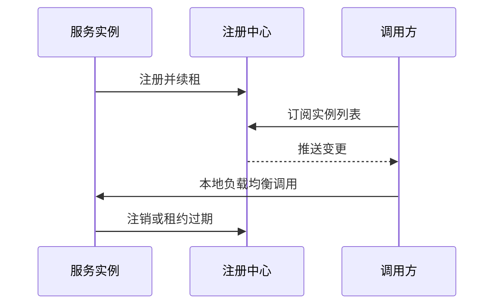

# 微服务之间如何自动发现彼此？具体原理是什么？

日期：2026-07-11  
标签：#面试 #八股 #后端 #微服务 #服务发现 #场景题

## 一句话答案

服务实例启动后向注册中心登记地址并通过心跳/租约维持存活，调用方或代理监听实例列表、健康状态和版本，再通过负载均衡选择目标实例。

## 面试口语版

服务发现分客户端发现和服务端发现。客户端发现中，实例向 Nacos/Consul/etcd 等注册，客户端订阅服务名的实例列表并本地负载均衡；服务端发现中，客户端只调用网关、负载均衡器或 Service VIP，由代理选择实例。注册信息通过心跳或租约续期，超时实例被摘除；实例下线先注销并等待客户端收敛。Kubernetes 中 Pod 由控制器维护 EndpointSlice，Service 通过 DNS 和 kube-proxy/eBPF 提供稳定访问地址。

## 原理图

## 关键细节

- 注册中心短暂不一致时客户端依靠本地快照、健康检查和失败摘除。
- 健康检查区分存活和就绪，未预热实例不能接流量。
- 元数据可用于版本、机房、权重和灰度路由。
- 服务发现解决“去哪调用”，不自动解决超时、熔断和兼容性。

## 面试官追问

1. 注册中心挂了还能调用吗？
2. 心跳超时设置太短或太长有什么问题？
3. 客户端发现与服务端发现如何选择？

## 面试官追问参考答案

### 1. 注册中心挂了还能调用吗？

客户端应使用最近一次本地实例快照继续调用，并结合连接失败摘除和健康检查；但快照有最大陈旧时间，新实例和下线信息无法及时获知。注册中心本身也需多节点高可用。

### 2. 心跳超时设置太短或太长有什么问题？

太短会因网络抖动或 GC 暂停误摘健康实例，造成流量震荡；太长则故障实例长时间留在列表。应根据心跳周期、网络环境和故障检测目标设置，并采用连续失败与迟滞恢复。

### 3. 客户端发现与服务端发现如何选择？

客户端发现少一跳、可做精细路由，但每种语言都需 SDK 并维护逻辑；服务端发现对客户端透明、治理集中，但增加代理层和一跳。多语言/Kubernetes 常偏代理或 Service，统一 Java 技术栈可用客户端发现。

## 学习清单

- [ ] 掌握注册、续租、订阅和摘除流程。
- [ ] 能比较客户端与服务端发现。

