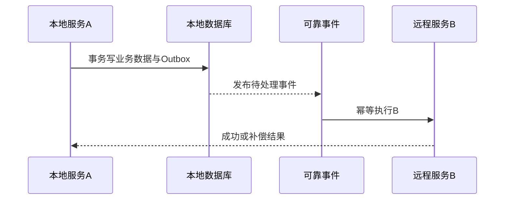

# 本地操作 A 与远程操作 B 如何保证事务一致性？

日期：2026-07-11  
标签：#面试 #八股 #后端 #分布式事务 #场景题

## 一句话答案

本地数据库事务无法包住远程调用，通常用 Outbox/Saga 实现最终一致；若远程 B 支持预留、确认和取消，可采用 TCC，所有步骤必须幂等并可补偿。

## 面试口语版

我先根据业务问是一致完成还是允许最终一致。多数场景让 A 的业务变更和待执行 B 的 Outbox 事件写在同一本地事务中，后台可靠发送，B 按业务唯一键幂等执行；B 成功后回写状态，失败持续重试或触发 A 的补偿，这就是 Saga 思路。若资金、库存要求更强控制，且 B 提供 Try/Confirm/Cancel，可用 TCC：先预留资源，全部成功后确认，否则取消。不能在数据库事务中直接同步调用 B 并认为两者原子，超时会产生未知状态和长事务。

## 流程图

## 关键细节

- 远程超时是未知，不等于 B 未执行。
- 补偿不是数据库回滚，必须定义业务可逆操作。
- 事件重复、乱序和长期失败都需状态机处理。
- 2PC 强一致成本高、可用性差，只在合适基础设施和场景使用。

## 面试官追问

1. Outbox 为什么能避免本地成功但消息丢失？
2. B 成功但确认响应丢失怎么办？
3. 哪些操作不适合 Saga 补偿？

## 面试官追问参考答案

### 1. Outbox 为什么能避免本地成功但消息丢失？

A 的业务数据和 Outbox 记录在同一个本地事务中提交，事务成功就一定有可重试的事件。后台扫描或 CDC 发布，发送确认后标记完成，重复发布由 B 幂等处理。

### 2. B 成功但确认响应丢失怎么办？

A 保持处理中并用相同业务幂等键重试或查询 B，B 返回首次执行结果而不重复产生副作用。最终由状态查询和对账确认，不能因一次超时直接补偿。

### 3. 哪些操作不适合 Saga 补偿？

不可逆或外部已产生永久影响的动作，例如已发送不可撤回通知、某些清算或实物发货，补偿只能形成新业务动作而非恢复原状。此类操作应尽量后置到事务确认后，并准备人工处理。

## 学习清单

- [ ] 掌握 Outbox、Saga 和 TCC 的适用边界。
- [ ] 理解未知状态、幂等与补偿。

