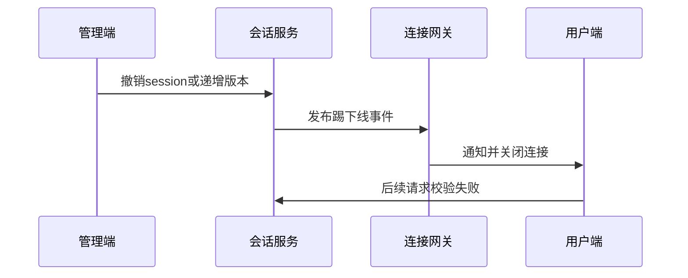

# 如何设计将已登录用户踢下线的功能？

日期：2026-07-11  
标签：#面试 #八股 #后端 #登录态 #场景题

## 一句话答案

服务端撤销目标会话或递增用户会话版本，并向在线网关推送下线事件；后续 HTTP 和长连接请求都必须校验最新会话状态。

## 面试口语版

登录时为每个设备生成 sessionId，服务端记录 userId、设备、状态和版本。踢单设备就将该 session 标记 revoked，踢全部设备则递增 user 的 sessionVersion 或撤销全部会话。网关收到 MQ/PubSub 下线事件后找到对应 WebSocket 连接，发送下线原因并关闭。HTTP 请求校验 Session 或 Token 中的版本，旧 Token 即使仍在有效期也被拒绝。事件可能丢失，所以每次重连和敏感请求仍需查询权威会话状态。

## 流程图

## 关键细节

- 区分单设备、其他设备和全部设备下线。
- 记录操作者、原因、时间和目标会话审计日志。
- JWT 需结合 sessionVersion/黑名单或短有效期。
- 客户端通知只改善体验，服务端拒绝才是安全保障。

## 面试官追问

1. 踢下线消息丢失怎么办？
2. 用户离线时如何踢？
3. 如何只踢某一台设备？

## 面试官追问参考答案

### 1. 踢下线消息丢失怎么办？

会话撤销先写权威存储，推送只是加速。网关心跳、重连和敏感请求定期校验 sessionVersion；即使连接未立即关闭，后续业务请求也会被拒绝。

### 2. 用户离线时如何踢？

直接撤销服务端会话即可，无需在线推送。用户下次启动或刷新 Token 时校验失败并跳转登录页，可展示服务端记录的下线原因。

### 3. 如何只踢某一台设备？

每次登录生成独立 sessionId 并记录 deviceId，撤销指定 session，而不是递增全用户版本。Token 中携带 sessionId，服务端校验该会话状态。

## 学习清单

- [ ] 理解会话撤销与在线连接关闭的区别。
- [ ] 能处理 JWT 和多设备登录。

