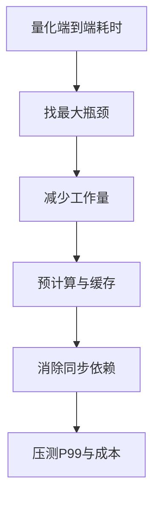

# 一条 1s 请求的响应，怎么优化成 1ms？

日期：2026-07-11  
标签：#面试 #八股 #后端 #性能优化 #场景题

## 一句话答案

先质疑目标并拆解 1 秒耗时；跨网络和动态计算通常无法稳定到 1ms，只有通过预计算、内存/边缘缓存、减少依赖和改变产品语义，才可能接近。

## 面试口语版

我不会直接承诺优化一千倍。先明确 1ms 是服务端处理、机房内 P99 还是用户端到端，以及数据新鲜度要求。用 Trace 把 1 秒拆成排队、网络、SQL、RPC、计算和序列化，先处理最大瓶颈。如果结果可预计算，就离线或事件驱动生成读模型，放本地内存、Redis 或 CDN，接口只做 O(1) Key 查询；减少同步下游、批量调用、连接复用和对象分配。若要求跨地域、强一致实时计算，物理网络延迟就可能超过 1ms，应协商更现实 SLO 或异步返回。

## 优化层次

## 关键细节

- 不要用平均值宣称 1ms，应看 P99/P999 和错误率。
- 缓存要定义一致性、失效和冷启动。
- 优化常来自改变计算时机，而非微调代码。
- 1ms 目标可能需要同进程内存读取，跨服务调用预算极小。

## 面试官追问

1. 缓存把接口降到 1ms，数据一致性怎么办？
2. 如何证明优化真的有效？
3. 如果不能改变业务语义怎么办？

## 面试官追问参考答案

### 1. 缓存把接口降到 1ms，数据一致性怎么办？

先定义允许陈旧窗口，采用事件更新/CDC 主动刷新加 TTL 兜底，Key 带版本避免旧值覆盖。强读己之写可在写后短期读主或等待版本水位；若必须线性一致，1ms 目标可能不可实现。

### 2. 如何证明优化真的有效？

在接近生产数据和并发下对比基线，观察端到端 P50/P99/P999、吞吐、错误率、资源和缓存命中率。灰度发布并比较实验组，覆盖冷缓存、热点、依赖故障和峰值，而非单机一次调用。

### 3. 如果不能改变业务语义怎么办？

优化执行计划、数据结构、并行性和部署位置，但仍受网络与一致性下限约束。基于测量给出可达 SLO 和成本，必要时增加专用硬件/同机部署；不能用技术话术承诺违反物理边界的指标。

## 学习清单

- [ ] 会先澄清延迟口径和一致性要求。
- [ ] 理解预计算、缓存和关键路径缩短。

