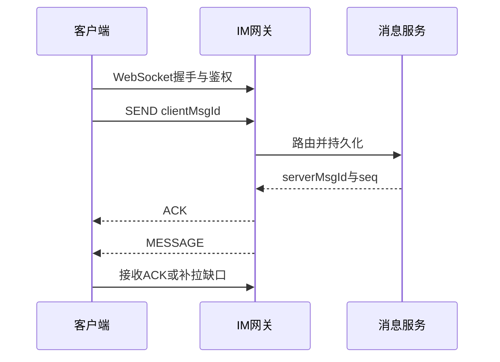

# WebSocket 是什么？设计 IM 协议要考虑什么？

日期：2026-07-11  
标签：#面试 #八股 #后端 #WebSocket #IM #系统设计

## 一句话答案

WebSocket 提供 HTTP Upgrade 后的全双工长连接；IM 协议还要定义鉴权、消息 ID、会话序号、ACK、重传、心跳、断线续传、多端同步、压缩和安全边界。

## 面试口语版

WebSocket 解决双向实时传输，但不自动保证消息可靠、有序或不重复。协议层我会定义固定头：版本、消息类型、requestId、conversationId、clientMsgId、serverMsgId/seq、时间戳、压缩和 body 长度。连接建立后先鉴权，心跳检测半开；发送消息先返回接收 ACK，服务端持久化并分配会话 seq 后投递，客户端按 messageId 去重、按 seq 排序，发现缺口主动补拉。断线重连携带最后同步游标，多端用设备 ID 和已读游标同步；大文件只传元数据，内容走对象存储。

## 协议流程

## 关键细节

- TCP 有序不等于业务消息跨重连、跨设备仍有序。
- 至少一次投递需要客户端和服务端幂等去重。
- 心跳间隔兼顾移动端耗电、NAT 超时和故障发现速度。
- 协议需有版本兼容、最大帧长度、限流、加密和防重放。

## 面试官追问

1. WebSocket 断线后如何补消息？
2. 如何保证同一会话消息有序？
3. ACK 分为哪些层次？

## 面试官追问参考答案

### 1. WebSocket 断线后如何补消息？

客户端持久化最后收到的会话 seq 或全局同步游标，重连鉴权后向服务端请求游标之后的消息；服务端分页返回并标记是否还有。客户端按 messageId 去重，并检测 seq 缺口继续补拉。

### 2. 如何保证同一会话消息有序？

同一 conversationId 路由到固定分区/顺序器，由服务端分配单调 seq。客户端以 seq 排序而非网络到达时间，缺口暂存并补拉；全局顺序通常没必要且吞吐代价高。

### 3. ACK 分为哪些层次？

可区分网关已接收、服务端已持久化、目标设备已送达和用户已读。不同层次语义不同，发送方 UI 也应分别展示；不能收到 TCP 写成功就宣称对方已读。

## 学习清单

- [ ] 能设计消息头和发送时序。
- [ ] 理解 ACK、重传、去重和断线续传。

