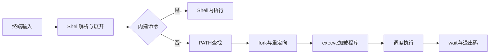

# 在 Linux 命令行敲下一行命令，会发生什么？

日期：2026-07-11  
标签：#面试 #八股 #后端 #Linux #Shell #场景题

## 一句话答案

终端驱动把输入交给 Shell，Shell 解析语法并完成展开、重定向和管道，内建命令直接执行，外部命令通过 PATH 查找后 fork/exec，内核调度进程并最终由 Shell 回收状态。

## 面试口语版

按下回车后，终端把一行字符送给前台进程组中的 Shell。Shell 做词法和语法解析，然后依次处理变量、命令替换、通配符、引号和重定向。若是 `cd` 这类内建命令就在 Shell 进程内执行；外部命令按 PATH 查找可执行文件，通常 fork 子进程，在子进程中设置文件描述符、管道和环境，再调用 execve 让内核加载 ELF、动态链接器和共享库。内核调度执行，输出写到终端或重定向目标，结束后父 Shell wait 获取退出码并显示下一次提示符。

## 流程图

## 关键细节

- 管道在 fork 前创建，子进程通过 dup2 把标准输入输出连接到管道。
- `cd` 必须是内建命令，否则子进程改目录不会影响父 Shell。
- exec 成功后不会返回，原进程地址空间被新程序替换。
- 命令替换和 glob 的先后与具体 Shell 规则有关。

## 面试官追问

1. 为什么 `cd` 不能简单做成普通外部程序？
2. fork 后父子进程内存会立即完整复制吗？
3. 管道 `a | b` 如何连接？

## 面试官追问参考答案

### 1. 为什么 `cd` 不能简单做成普通外部程序？

工作目录是进程属性，外部程序只能改变子进程自己的目录，退出后父 Shell 不受影响。作为 Shell 内建命令才能修改当前 Shell 的工作目录。

### 2. fork 后父子进程内存会立即完整复制吗？

现代 Linux 通常使用 Copy-on-Write，父子先共享物理页并标记只读，任一方写入时才复制相关页。页表等元数据仍需复制，fork 大进程也并非零成本。

### 3. 管道 `a | b` 如何连接？

Shell 创建 pipe 得到读写文件描述符，fork 两个子进程；a 用 dup2 将标准输出指向管道写端，b 将标准输入指向读端，关闭无关端点后各自 exec。内核管道缓冲负责传输并提供背压。

## 学习清单

- [ ] 掌握解析、fork、exec、wait 主链路。
- [ ] 理解文件描述符、重定向和管道。

