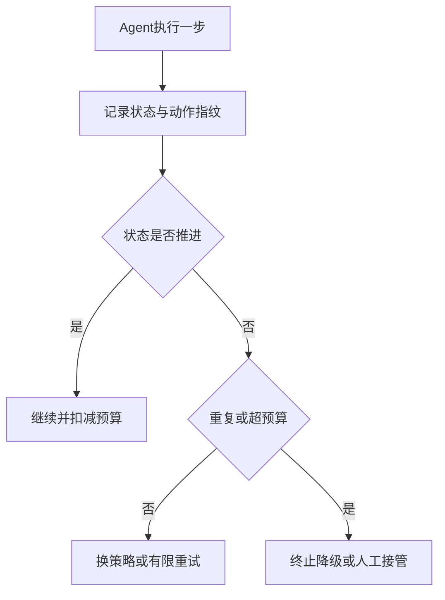

# Agent 死循环问题如何排查和解决？

日期：2026-07-12  
标签：#面试 #八股 #后端 #AI #大模型 #Agent #场景题

## 一句话答案

Agent 死循环通常来自状态未推进、工具结果不明确或模型重复规划，应通过步数/时间/Token 预算、循环检测、显式状态机、工具幂等和人工中断共同治理。

## 面试口语版

我会先用完整轨迹判断是模型反复思考、重复调用同一工具，还是工具失败后状态没有更新。每次执行都要记录 observation、action、参数、结果摘要和状态版本。运行时设置最大步骤、墙钟时间、Token、费用和单工具重试预算；对最近 N 步做指纹，连续出现相同“动作+参数+结果”就触发熔断。架构上把开放式 ReAct 收敛为有向状态机，工具返回结构化成功/失败/可重试状态，并要求每一步产生可验证进展。高风险或多次失败转人工。

## 治理流程

## 关键细节

- 停止条件必须是程序可验证状态，而非只靠模型说“完成”。
- 工具调用携带幂等键，避免循环导致重复付款、发信或改数据。
- 区分“任务长期运行”和“无进展循环”，不能只设固定步数。
- 对上下文压缩和错误恢复做测试，状态丢失也会导致重复。

## 面试官追问

1. 如何程序化识别 Agent 正在循环？
2. 达到最大步数但任务尚未完成怎么办？
3. 如何避免循环工具调用产生副作用？

## 面试官追问参考答案

### 1. 如何程序化识别 Agent 正在循环？

对动作类型、规范化参数、工具结果摘要和关键状态做哈希，检测固定周期重复；同时观察目标距离、状态版本或已完成子任务是否长期不变。语义相似动作可用规则或向量相似度辅助，但最终以“无可验证进展”判断。

### 2. 达到最大步数但任务尚未完成怎么办？

保存可恢复的 checkpoint、已完成工作和明确阻塞原因，选择降级结果、重新规划一次或请求人工输入。不能静默重置预算无限继续；扩大预算需由策略或用户授权。

### 3. 如何避免循环工具调用产生副作用？

每个业务动作携带稳定幂等键，工具服务保存执行结果并对重复请求返回原结果；写操作使用确认门槛、权限和金额上限。Agent 重试前先查询状态，而不是盲目再次执行。

## 学习清单

- [ ] 理解预算、循环检测和状态机治理。
- [ ] 能设计工具幂等与人工接管。

