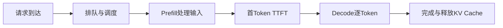

# LLM 集群吞吐 1000 tokens/s，1000 用户并发时每人只有 1 token/s 吗？

日期：2026-07-12  
标签：#面试 #八股 #后端 #大模型 #LLM推理 #性能分析

## 一句话答案

1000 tokens/s 是集群聚合吞吐时，长期满载下平均可用份额上界确实约为每用户 1 token/s，但真实体验还由 Prefill、Decode、连续批处理、请求长度、调度、KV Cache 和 TTFT 决定，不能简单平均。

## 面试口语版

先确认 1000 tokens/s 是输出吞吐、输入加输出吞吐，还是某个固定模型和批次下的峰值。1000 个请求持续同时 Decode 时，聚合输出吞吐除以活跃请求数是平均 TPS 上界，但调度不会保证人人均分；短请求会先完成，连续批处理会动态加入和移出序列。用户体验至少看 TTFT、每用户 TPOT/ITL、端到端时延和吞吐。瓶颈可能在 Prefill 算力、Decode 内存带宽、KV Cache 容量、批处理效率、网络或排队。应按输入/输出长度分桶压测，并设置并发上限、排队、优先级和模型副本扩容。

## 性能拆解

## 关键细节

- TTFT 与输出速度是不同指标。
- 长 Context 会显著占用 KV Cache，可能限制可并发序列数。
- 增大 Batch 通常提高总吞吐，却可能恶化单请求延迟。
- 需要用 Goodput 衡量满足 SLO 的有效吞吐，而非只看峰值 tokens/s。

## 面试官追问

1. Prefill 和 Decode 的瓶颈有什么不同？
2. 为什么 Batch 越大总吞吐高但用户可能更慢？
3. 如何做容量规划？

## 面试官追问参考答案

### 1. Prefill 和 Decode 的瓶颈有什么不同？

Prefill 一次处理整段输入，矩阵计算密集，长 Prompt 会提高 TTFT；Decode 每步只生成一个 token，通常更受内存带宽和 KV Cache 读取影响。两者可通过分离部署或调度分别优化。

### 2. 为什么 Batch 越大总吞吐高但用户可能更慢？

更大 Batch 提高 GPU 利用率和摊薄开销，但请求需等待凑批，每轮调度处理更多序列，单请求 token 间隔和排队可能增加。应以 TTFT/TPOT SLO 下的 Goodput 选 Batch，而非最大吞吐。

### 3. 如何做容量规划？

收集输入/输出 token 分布、并发曲线和 TTFT/TPOT 目标，用真实模型压测不同 Batch 和上下文长度，计算每副本 Goodput。再加入峰值、安全余量、故障副本和 KV Cache 水位，配置准入与自动扩容。

## 学习清单

- [ ] 区分聚合吞吐、TTFT、TPOT 和 Goodput。
- [ ] 理解连续批处理与 KV Cache。

