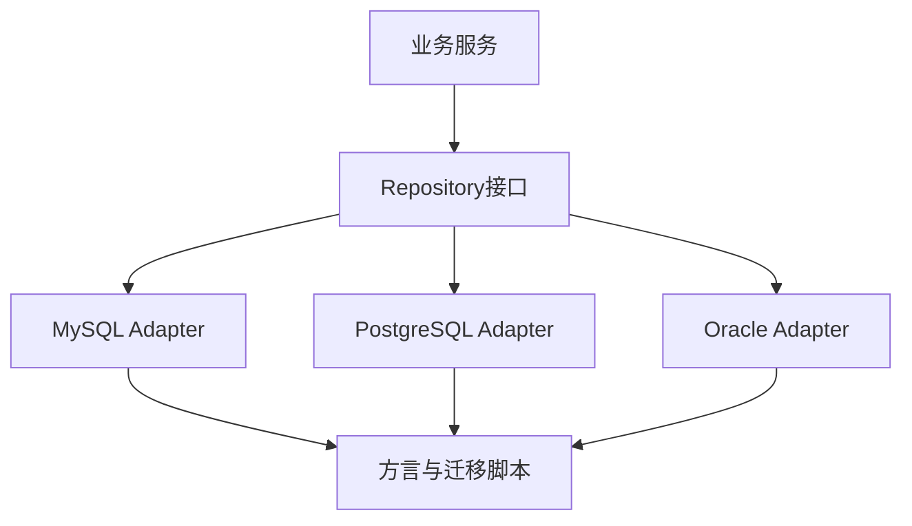

# 同一功能需要适配多种数据库，如何实现？

日期：2026-07-12  
标签：#面试 #八股 #后端 #数据库 #架构设计 #场景题

## 一句话答案

通过端口适配器或 DAO 抽象隔离数据库差异，以标准 SQL 为主，方言、DDL、分页、类型和锁语义通过独立实现封装，并对每种数据库做真实集成测试。

## 面试口语版

业务层只依赖 Repository 接口，MySQL、PostgreSQL、Oracle 等各自实现 Adapter；通用 CRUD 尽量使用标准 SQL 或 ORM，数据库特有函数、Upsert、分页、序列、JSON 和锁语法放在 Dialect 层，不让 if-else 散落业务代码。Schema 迁移按数据库维护脚本或模板，统一领域类型并显式处理布尔、时间、UUID 和大字段差异。测试不能只用 H2 模拟，要通过 Testcontainers/真实数据库跑契约、事务、并发和执行计划测试。若最低公分母严重影响性能，可允许能力扩展而非强行完全一致。

## 架构示意

## 关键细节

- SQL 语法兼容不代表事务隔离和锁行为相同。
- 不把数据库异常字符串直接暴露给业务，映射为统一错误。
- 时间精度、排序规则、NULL 和大小写需专项测试。
- 每种数据库的索引和执行计划应独立调优。

## 面试官追问

1. ORM 能完全屏蔽数据库差异吗？
2. 数据库特有优化与可移植性如何权衡？
3. 为什么不能只用 H2 做兼容测试？

## 面试官追问参考答案

### 1. ORM 能完全屏蔽数据库差异吗？

不能。ORM 可屏蔽基础 CRUD，但分页、Upsert、序列、JSON、全文索引、锁和隔离级别仍有差异，生成 SQL 的性能也不同。关键 SQL 应明确方言并验证计划。

### 2. 数据库特有优化与可移植性如何权衡？

核心业务接口保持统一，把特有能力封装在可替换 Adapter，通过能力探测选择实现。先满足正确性，再允许高价值场景使用特性优化，并提供通用降级方案和独立测试。

### 3. 为什么不能只用 H2 做兼容测试？

H2 的语法兼容模式、类型、优化器、锁和事务语义与目标数据库不完全相同，测试通过不代表生产正确。应在 CI 中运行真实数据库容器，H2 只适合快速单元测试。

## 学习清单

- [ ] 理解 Repository、Adapter 和 Dialect 分层。
- [ ] 能列出语法之外的数据库差异。

