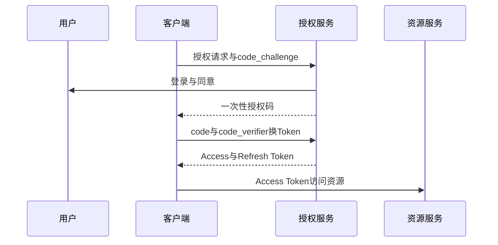

# 如何设计 OAuth 2.0 授权服务？Token 如何管理？

日期：2026-07-12  
标签：#面试 #八股 #后端 #OAuth2 #安全 #系统设计

## 一句话答案

授权服务负责客户端注册、用户认证与同意、授权码和 Token 签发/撤销；用户应用优先授权码加 PKCE，Access Token 短期有效，Refresh Token 轮换并由服务端管理会话。

## 面试口语版

核心组件包括客户端注册、登录/MFA、Consent、Authorization Endpoint、Token Endpoint、密钥管理、撤销、Introspection 和审计。Web/移动应用使用 Authorization Code + PKCE：前端只拿一次性短期授权码，后端用 code_verifier 换 Token。Access Token 短期有效，可用 JWT 本地验签或 opaque token 在线查询；Refresh Token 长期但只存安全端，采用轮换和复用检测。Token 绑定 client、用户、scope、audience 和会话，资源服务器严格校验 iss、aud、exp、scope。服务间调用使用 Client Credentials，并限制最小权限。

## 授权码流程

## 关键细节

- Redirect URI 必须精确匹配，防授权码劫持和开放重定向。
- `state` 防 CSRF，`nonce` 属于 OIDC 身份层使用。
- 密钥放 KMS/HSM，JWKS 支持 kid 轮换与缓存。
- Scope 不是角色的简单替代，资源服务仍需对象级授权。

## 面试官追问

1. JWT Access Token 和 opaque token 如何选择？
2. PKCE 解决什么问题？
3. Refresh Token 被盗怎么办？

## 面试官追问参考答案

### 1. JWT Access Token 和 opaque token 如何选择？

JWT 可由资源服务本地验签，低延迟、少依赖，但即时撤销困难且声明暴露；opaque token 通过 Introspection 查询，易集中撤销和隐藏信息，但增加网络与授权服务压力。可按风险使用短 JWT 加撤销状态，或 opaque 加缓存。

### 2. PKCE 解决什么问题？

客户端先生成 verifier，只发送其 challenge；攻击者即使截获授权码，没有 verifier 也无法换 Token。它尤其保护无法安全保存 client secret 的移动端和 SPA，现在授权码流程普遍建议使用。

### 3. Refresh Token 被盗怎么办？

采用每次刷新即轮换，旧 Token 再次出现触发复用检测并撤销整个 Token family。绑定客户端/设备风险信息、缩短闲置与绝对期限，重要事件通知用户并要求重新认证。

## 学习清单

- [ ] 掌握授权码加 PKCE 流程。
- [ ] 理解 Token 生命周期、撤销和密钥轮换。

