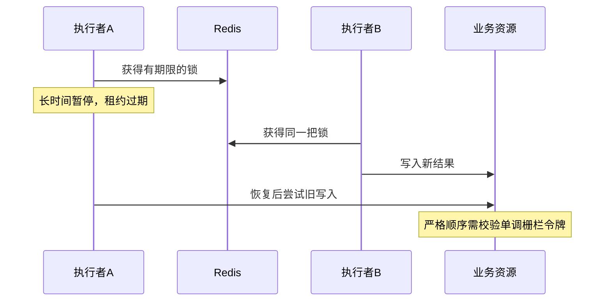

# 基于 Redis 实现分布式锁有什么优缺点？

日期：2026-09-27  
标签：#面试 #场景设计 #Redis  
难度：简单  
来源：[牛面场景题](https://niumianoffer.com/nm_practice/questions?bank_id=bank_1757645675392050216&activeIndex=0)  
答案说明：独立整理（站内题目标记为 VIP，未读取会员答案）

## 一句话答案

Redis 锁接入简单、响应快，适合容忍少量故障窗口内重复执行的任务；租约过期与主从切换可能破坏互斥，关键写入还须在资源侧拒绝旧持有者。

## 面试口语版（约 60 秒）

我会先问业务要的是“尽量只有一个执行者”，还是“绝不能发生并发写”。单实例 Redis 常用 `SET lock:key 随机令牌 NX PX 租约` 获取锁，释放时原子比较令牌并删除，避免误删别人的锁。优点是实现和部署成本低、响应快，还能利用已有 Redis。局限是任务暂停超过租约后，旧执行者可能继续运行；主从异步复制时，主节点在锁写入尚未同步前故障，新的主节点也可能把锁授给别人。续期只能降低概率，不能替代正确性设计。若必须严格拒绝旧持有者写入，下游应校验与获锁顺序关联的单调栅栏令牌，并评估更合适的协调或事务机制；普通乐观版本条件不一定能识别旧持有者。

## 原理与场景

1. **加锁**：唯一随机令牌标识本次持有者，`NX` 与 `PX` 在一条 `SET` 中完成；等待者设置超时和退避。
2. **解锁**：仅在令牌匹配时删除。Redis 8.4 起可用 `DELEX key IFEQ token`；较早版本用 Lua 合并比较与删除。裸 `DEL` 会误删别人重新获得的锁。
3. **续期**：只有令牌仍匹配且任务仍运行时才延长租约；续期失败后停止可中止的后续工作。

例如定时刷新排行榜，重复计算一次通常可容忍；扣减余额则应依赖数据库事务与业务幂等约束，不能让 Redis 锁独自兜底。旧执行者恢复后仍能向数据库写入，Redis 上的令牌检查管不到该写入。若使用栅栏令牌，它必须来自能保持单调性的权威来源，且由业务资源比较；普通 `WHERE version=旧值` 只能防部分并发冲突，不能保证新持有者尚未写入时旧持有者一定被拒绝。

## 取舍与易错点

- 短租约可能带来并发执行；长租约会延长故障恢复等待；高竞争需要限制重试负载。
- “加了 Redis 锁就绝对不会并发”是错误说法。官方文档明确指出异步复制切主的互斥风险；Redlock 也有时间与故障假设。
- 观察获取失败率、等待时长、持锁时长、续期失败和受保护操作的版本冲突。

## 面试官递进追问

1. 为什么 `NX` 与过期时间要放在同一条命令？
2. A 的锁过期后 B 接手，A 解锁会发生什么？
3. A 在 GC 暂停后继续写数据库，为什么比较令牌删除和续期都挡不住它？

## 自测

- 不看笔记，60 秒讲出适用边界、加解锁步骤、两个互斥失效分支。
- 画出旧持有者恢复写入时间线，指出栅栏校验应发生在哪里。

## 参考资料

- [Redis 官方：Distributed Locks with Redis](https://redis.io/docs/latest/develop/clients/patterns/distributed-locks/)
- [Redis 官方：SET](https://redis.io/docs/latest/commands/set/)

资料核对日期：2026-09-27。
