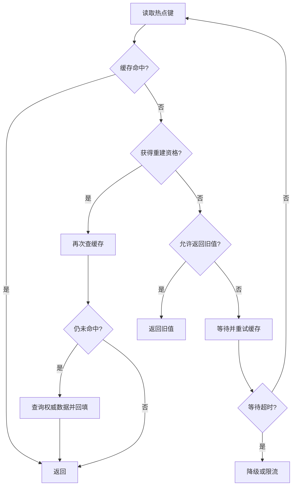

# 什么是缓存击穿？如何解决？

日期：2026-09-27  
标签：#面试 #场景设计 #Redis  
难度：中等  
来源：[牛面场景题](https://niumianoffer.com/nm_practice/questions?bank_id=bank_1757645675392050216&activeIndex=0)  
答案说明：独立整理（站内题目标记为 VIP，未读取会员答案）

## 一句话答案

缓存击穿是一个存在的热点键失效后，大量并发读同一时间回源；核心是让同一键的重建合并、限制回源并发，并按业务陈旧容忍度决定是否返回旧值。

## 面试口语版（约 60 秒）

比如爆款商品详情刚过期，很多请求同时看到缓存未命中，都去查数据库，单个热点键就能造成回源尖峰。常用办法是在应用内或跨实例做“同键只让一个请求重建”：抢到重建资格的请求查数据库并回填，其他请求短暂等待、重试缓存，或在允许陈旧时返回旧值。重建者还要在获得资格后再查一次缓存，防止重复加载。若数据库不可用，不能让等待者无限堵住，要设置等待超时、并发上限和降级策略。对可预测的热点可提前刷新。要注意互斥重建降低的是重复查询，不能解决单个查询本身慢，也不能让旧值适用于库存等强一致判断。

## 请求流程

若重建资格使用 Redis 锁，应有短租约、唯一令牌和条件释放；重建者崩溃时资格最终要释放。若多个实例只使用各自进程内的 single-flight，每个实例仍可能各自回源，需按下游容量判断是否足够。

## 取舍与易错点

- **互斥重建**：减少数据库并发，但等待者延迟上升；重建慢时仍须超时和降级。
- **逻辑过期 / 旧值兜底**：响应平稳，但会返回陈旧数据，只适合可容忍陈旧的页面或推荐结果。
- **预热与提前刷新**：适合已知热点，需处理刷新失败和实际热点变化。
- 关注每键未命中量、同键回源并发、重建耗时、等待超时和旧值返回比例。

## 面试官递进追问

1. 击穿和穿透在“数据是否存在”上有什么区别？
2. 为什么获得重建锁后还要再次检查缓存？
3. 重建者崩溃或数据库超时，等待请求如何避免堆积？

## 自测

- 不看笔记，60 秒解释热点键过期到数据库尖峰的链路。
- 给“商品详情”和“实时库存”分别选一种兜底方式，并解释陈旧值边界。

## 参考资料

- [Redis 官方：Cache-aside 模式及 stampede 保护](https://redis.io/docs/latest/develop/use-cases/cache-aside/)
- [Redis 官方：Node.js cache-aside 示例中的 single-flight 重建](https://redis.io/docs/latest/develop/use-cases/cache-aside/nodejs/)

资料核对日期：2026-09-27。
