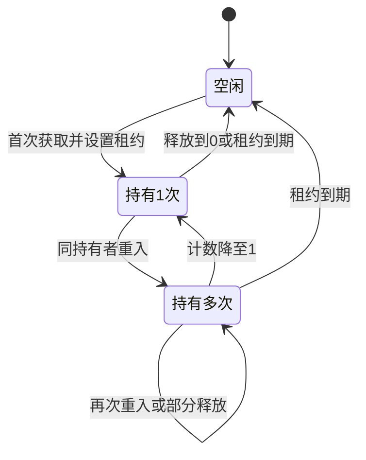

# 怎么用Redis实现可重入的分布式锁？

日期：2026-09-27  
标签：#面试 #场景设计 #Redis  
难度：中等  
来源：[牛面场景题](https://niumianoffer.com/nm_practice/questions?bank_id=bank_1757645675392050216&activeIndex=0)  
答案说明：独立整理（站内题目标记为 VIP，未读取会员答案）

## 一句话答案

为同一把锁保存“本次最外层获锁的唯一令牌 + 重入次数 + 租约”；嵌套调用共享该令牌并原子递增，释放时递减，次数归零才删除。新一轮独立获锁必须换令牌。

## 面试口语版（约 60 秒）

普通 Redis 锁的 `SET NX` 在同一调用链第二次获取时也会失败，可能造成自身等待。可重入锁应在每次最外层获锁时生成新的随机令牌，放入本次执行上下文，只有嵌套调用共享它；不能只用服务实例 ID 或长期复用的线程 ID，否则不同请求或下一轮独立获锁可能被误认成旧持有者。Redis 中可用 Hash 保存 `owner` 令牌和 `count`，首次获取设为 1 并设租约；再次获取先确认令牌相同再加 1；释放时只有令牌匹配才能减 1，减到 0 才删键。判断、修改与租约设置要放进原子脚本。租约过期、续期失败和切主仍可能破坏互斥，重入不改变这些边界。

## 状态与伪代码



```text
# 每次最外层调用生成新 grant_token；嵌套调用只继承本轮令牌
outer_acquire(key, lease, context):
    grant_token = random_unique_token()
    result = acquire(key, grant_token, lease, allow_new=true)
    if result == ACQUIRED:
        context.grant_token = grant_token
    return result

nested_acquire(key, lease, context):
    if context.grant_token is absent: return NOT_OWNER
    return acquire(key, context.grant_token, lease, allow_new=false)

# 获取、释放各在 Redis 的单个原子脚本内执行
acquire(key, grant_token, lease, allow_new):
    if key does not exist:
        if not allow_new: return LOST
        HSET key owner=grant_token count=1; PEXPIRE key lease; return ACQUIRED
    if HGET key owner == grant_token:
        HINCRBY key count 1; PEXPIRE key lease; return REENTERED
    return BUSY

release(key, grant_token):
    if key does not exist or HGET key owner != grant_token: return NOT_OWNER
    if HGET key count > 1:
        HINCRBY key count -1; return STILL_HELD
    DEL key; return RELEASED
```

示例：方法 A 本轮获得订单锁后调用方法 B，B 继承本轮令牌重入，计数由 1 到 2；B 返回时减到 1，A 完成后减到 0 并清除上下文令牌。若 B 异常漏释放，锁仍会等到租约过期；若租约先过期而另一个执行者接手，旧执行者后续释放必须返回 `NOT_OWNER`，不能删除新锁。旧执行上下文即使再次申请最外层锁，也必须生成新令牌。续期仍需校验令牌，不能把旧任务恢复后的写入视为安全。

## 取舍与易错点

- 原子脚本必须简短；Redis Lua 脚本执行期间会阻塞其他服务活动，不把长业务操作放进脚本。
- `owner` 令牌需跨本轮嵌套调用稳定、跨两轮独立获锁不同。线程 ID 单独使用不具备跨进程或跨获锁轮次的唯一性；异步跨线程还需显式传递上下文。
- 重入次数要与成功获取次数配平；调用失败路径放在 `finally` 释放，但只能由真正的持有者释放。
- 可参考社区项目 [Redisson 的 RLock](https://github.com/redisson/redisson/blob/master/docs/data-and-services/locks-and-synchronizers.md)：它提供可重入和续期能力；使用其线程所有权语义时，要检查异步调用与释放线程的关系。若业务要求严格拒绝旧持有者写入，仍需权威资源校验与获锁顺序关联的单调栅栏令牌；普通行版本检查不能替代该顺序保证。

## 面试官递进追问

1. 为什么普通 `SET NX` 锁不能自动重入？
2. 为什么 `owner` 只写服务实例 ID 会产生错误？
3. 计数为 2 时进程暂停、锁过期并被别人获取，旧任务恢复后怎样避免误删和旧写？

## 自测

- 不看笔记，60 秒说出状态、获取与释放规则、持有者身份设计。
- 手推“获取两次、释放一次、异常退出”和“租约过期后旧任务恢复”两条时间线。

## 参考资料

- [Redis 官方：Lua 脚本的原子执行](https://redis.io/docs/latest/develop/programmability/eval-intro/)
- [Redis 官方：HINCRBY](https://redis.io/docs/latest/commands/hincrby/)
- [Redis 官方：分布式锁的租约与旧持有者风险](https://redis.io/docs/latest/develop/clients/patterns/distributed-locks/)
- [Redisson 社区项目：锁与同步器](https://github.com/redisson/redisson/blob/master/docs/data-and-services/locks-and-synchronizers.md)

资料核对日期：2026-09-27。
