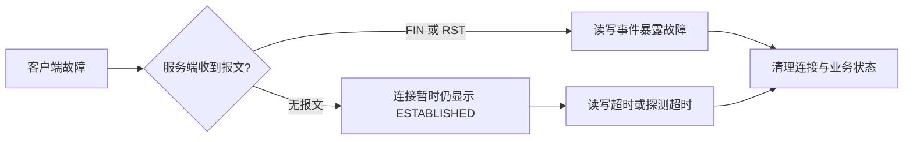

# 建立连接后，若客户端突然出现故障，服务端会如何处理？

日期：2026-09-27  
标签：#面试 #场景设计 #计算机网络  
难度：中等  
来源：[牛面场景题](https://niumianoffer.com/nm_practice/questions?bank_id=bank_1757645675392050216&activeIndex=0)  
答案说明：独立整理（站内题目标记为 VIP，未读取会员答案）

## 一句话答案

客户端故障不等于服务端立刻收到断开通知；服务端依赖 FIN/RST、后续读写失败、TCP 保活或应用心跳与超时发现连接失效，再清理连接和业务状态。

## 面试口语版（约 60 秒）

“我会先区分故障类型。如果客户端正常关闭，服务端读到 FIN，`read` 返回 EOF，可以按协议收尾；如果进程崩溃且操作系统仍能处理连接，可能收到 RST。若机器断电或网络黑洞，服务端可能长期保留一个看似已建立的连接，尤其在双方都不发数据时。服务端再次发送数据后，TCP 会重传并最终超时；开启 TCP keepalive 可以探测长时间空闲的对端，但探测周期通常不适合作为唯一业务故障判定。在线聊天这类场景我会加带序号的应用心跳和读空闲超时，连续漏掉阈值后断开会话、释放连接与订阅，同时让客户端重连时用会话令牌恢复。注意网络超时只说明‘当前不可达’，不能绝对证明对方已经死亡，断线重连后的消息要考虑去重。”

## 原理与场景拆解

| 情况 | 服务端常见观察 | 处理 |
| --- | --- | --- |
| 客户端有序关闭 | 收到 FIN，读返回 0/EOF；写方向可能尚未关闭 | 按半关闭语义完成待发送数据或主动关闭 |
| 进程退出、连接被重置 | 可能收到 RST，读写报错；具体时点取决于系统行为 | 清理 socket、会话和未完成请求 |
| 断电、断网、NAT 状态丢失 | 暂时无报文，服务端可能毫无感知 | 读写超时、保活探测或应用心跳后回收 |

**例子：** WebSocket 在线状态不能只凭 TCP 连接表。服务端每 15 秒发一次心跳，允许连续数次缺失后标记离线，并给重连留短暂宽限期；具体阈值由移动网络抖动、在线状态时效与资源成本决定。清理时还要取消订阅、超时中的 RPC 和连接关联的内存对象。

## 关键细节与常见误区

- TCP 本身不会因应用进程“心跳停止”自动立即关闭连接。RFC 9293 将对端无感知的关闭或重启列为半开连接；后续通信可能触发 RST。
- TCP keepalive 是可选机制，其参数由操作系统和应用配置；单次探测无回应不能直接判死。应用心跳可同时携带业务会话状态，但会增加流量与连接负载。
- `read` 阻塞不代表对端还活着；要设置合理的读空闲/请求超时。`write` 成功也只说明数据交给本机协议栈，不能证明业务端已处理。
- 超时后关闭 socket 只是本地决定；重试请求可能与客户端之前成功但未收到确认的请求重叠，需要请求 ID 和幂等处理。

## 面试官递进追问

1. FIN、RST 和没有任何报文时，服务端分别会看到什么？
2. TCP keepalive 与应用层心跳各解决什么问题，阈值如何设？
3. 客户端重连后重复提交了上一次超时的支付请求，如何判断和处理？

## 自测与学习清单

- 不看笔记，用 60 秒分别说明“进程崩溃”和“网络黑洞”两条路径。
- 画出心跳超时、会话清理、客户端重连和幂等重放的顺序。
- 用故障注入验证读写错误、连接回收时间和误判率，观察连接数、心跳超时率、重连率。

## 参考资料

- [RFC 9293：TCP，半开连接与 keep-alive](https://www.rfc-editor.org/rfc/rfc9293.html)（核对日期：2026-09-27）。
