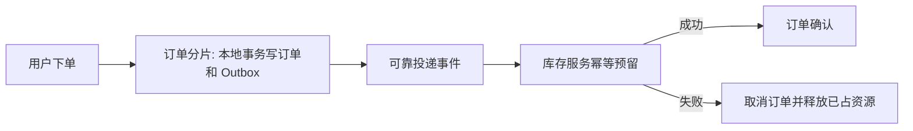

# 分库分表后会产生哪些问题？如何解决跨库查询和分布式事务？

日期：2026-09-27  
标签：#面试 #场景设计 #MySQL  
难度：困难  
来源：[牛面场景题](https://niumianoffer.com/nm_practice/questions?bank_id=bank_1757645675392050216&activeIndex=0)  
答案说明：独立整理（站内题目标记为 VIP，未读取会员答案）

## 一句话答案

分片把单库的连接、索引、排序和事务边界拆开了；先按访问模式选分片键并让高频读写共址，再为无法共址的查询和写入分别设计数据副本或分布式一致性流程。

## 面试口语版（约 75 秒）

“我不会先问用哪种分库中间件，而是先列核心查询和事务。比如订单按用户 ID 分片后，用户订单列表很容易路由，但运营按时间查全站订单会扫多个分片；订单与独立账户库扣款也失去了本地事务。跨库查询的首选是重塑数据模型：高频条件带分片键，同一业务聚合尽量共址，后台报表走异步汇总表或搜索/分析系统。不得不实时跨库查询时，做有界并行查询和归并排序，限制分片数、页深和超时。跨库写入要按一致性目标选择：强原子性且能承受协调成本时考虑 XA/2PC；多数长流程用 Saga 补偿；数据库状态与发消息的一致性用本地事务 Outbox，再由消费者幂等处理。最后要说明迁移、扩容、全局 ID、唯一约束和故障补偿的复杂度，不能把‘最终一致’当成自动成功。”

## 原理与场景拆解

| 问题 | 优先方案 | 成本与边界 |
| --- | --- | --- |
| 跨库 JOIN、聚合、排序、深分页 | 带分片键路由；读模型/汇总表；必要时有界散射查询、归并 | 读模型有延迟；散射成本随分片数增长 |
| 全局唯一 ID、跨分片唯一约束 | 全局 ID 生成；业务唯一键集中登记或重设计约束 | 中央登记可能成为热点；全局索引有维护成本 |
| 跨库写入 | 共址优先；需要跨库原子性时评估 XA/2PC，长流程用 Saga；Outbox 只衔接本库写入与事件发布 | XA 有协调与持锁成本；Saga 要补偿，Outbox 投递与消费要去重 |
| 扩容迁移 | 稳定路由规则、双读校验、渐进迁移 | 迁移窗口可能出现重复、漏读和写入顺序问题 |

**例子与失败分支：** 下单后库存预留超时，不能立即假定库存失败；先查事务状态或用同一业务 ID 幂等重试。若明确失败，执行订单取消；补偿也可能失败，因此要有重试、死信处理、人工核账和“处理中”状态。Outbox 保证的是业务数据与待发送事件在同一数据库事务落地，不保证消费者恰好执行一次。

## 关键细节与常见误区

- 分片键需要结合读写路径和数据倾斜评估；只按当前数据量选 `user_id % N`，后续扩容会遇到大量迁移。
- MySQL XA 可作为分布式事务资源管理器的一环，真正跨库协调还需要可靠的事务管理器与恢复流程；`PREPARED` 分支需处理，不能把单库 `COMMIT` 当作全局原子性。
- Saga 补偿是新的业务动作，不一定能完全撤销外部副作用；库存、优惠券等操作必须定义可补偿边界。
- 跨分片查询要明确一致性时点。每个分片各自返回最新数据，不天然形成全局一致快照。

## 面试官递进追问

1. 订单按用户分片，按订单号查询时如何定位分片？
2. 跨 32 个分片按创建时间排序取第 10 页，如何限制扫描和保证顺序稳定？
3. Outbox 事件重复投递，库存扣减成功但确认响应丢失，如何恢复而不重复扣减？

## 自测与学习清单

- 画一张“用户订单查询”与“运营全站报表”的数据路径图，说明为何选不同读模型。
- 分别列出 XA、Saga、Outbox 的一致性目标、故障恢复与额外成本。
- 为一个跨库下单流程写出状态机、幂等键、超时分支与对账任务。

## 参考资料

- [MySQL 8.4：XA Transactions](https://dev.mysql.com/doc/refman/8.4/en/xa.html)、[XA Restrictions](https://dev.mysql.com/doc/refman/8.4/en/xa-restrictions.html)（核对日期：2026-09-27）。
- [Microsoft Azure Architecture Center：Saga 模式](https://learn.microsoft.com/en-us/azure/architecture/patterns/saga)、[Debezium：Outbox Event Router](https://debezium.io/documentation/reference/transformations/outbox-event-router.html)（核对日期：2026-09-27）。
