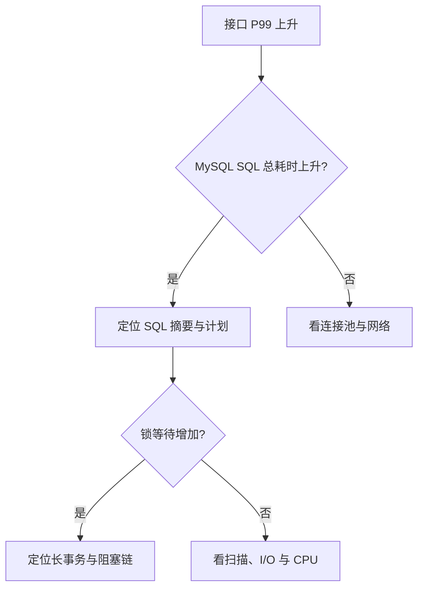

# 如何进行MySQL性能监控？关键性能指标有哪些？

日期：2026-09-27  
标签：#面试 #场景设计 #MySQL  
难度：困难  
来源：[牛面场景题](https://niumianoffer.com/nm_practice/questions?bank_id=bank_1757645675392050216&activeIndex=0)  
答案说明：独立整理（站内题目标记为 VIP，未读取会员答案）

## 一句话答案

MySQL 监控要把业务请求延迟与数据库内部等待、吞吐、资源和复制状态连起来看；单一 QPS、连接数或“复制延迟秒数”不足以解释故障。

## 面试口语版（约 70 秒）

“我会分四层监控。第一层是业务与 SQL：接口成功率、P95/P99、QPS/TPS、慢查询数量，以及按 SQL 摘要统计的总耗时和扫描行数。第二层是 MySQL 内部：活跃连接、正在执行的事务、锁等待和死锁、临时表与排序、缓冲池读写。第三层是主机资源：CPU、内存、磁盘延迟与吞吐、网络，避免把机器 I/O 饱和误诊为 SQL 问题。第四层是复制：接收线程、回放线程和各 worker 错误、待回放事务与读延迟。告警应按用户影响和持续时间设计，例如接口 P99 上升且锁等待同步增加，就先找长事务；如果复制回放积压，先把强一致读切回主库。监控基线要按业务峰谷比较，计数器算速率，不能仅看绝对值。”

## 指标与定位路径

| 层次 | 重点指标 | 典型用途 |
| --- | --- | --- |
| 用户与应用 | 成功率、P95/P99、超时率、连接池等待 | 判断真实影响和发生范围 |
| SQL | 语句摘要频次/总耗时/平均耗时、慢查询、扫描行数 | 找最值得优化的语句族 |
| 并发与事务 | 活跃线程、等待中的锁、死锁、长事务 | 找排队和阻塞源 |
| 内存与 I/O | 缓冲池读请求与物理读、脏页、磁盘延迟、CPU | 判断缓存或存储瓶颈 |
| 复制 | receiver/applier 状态、worker 错误、已接收/已执行 GTID、业务读陈旧度 | 区分接收与回放积压 |

**例子与失败分支：** 大促中 QPS 持平但下单 P99 从 100 ms 升到 3 s，活跃连接与行锁等待同步升高。此时扩连接数可能加重争锁；应先查热点商品行、事务持锁时间、重试风暴，并在应用侧做限流或排队。若是物理读和磁盘延迟同时上升，则转向索引、缓存命中和存储容量。

## 关键细节与常见误区

- MySQL 8.4 可用 Performance Schema 的语句摘要、等待事件、事务和复制表辅助排查；采集时确认相关 instrumentation 已启用，并控制采样与监控查询本身的开销。
- `Threads_connected` 不是“正在执行的查询数”；计数类状态值要看单位时间增量，并按实例与角色分组。
- 缓冲池命中率高不代表没有 I/O 瓶颈：绝对物理读量、读延迟和写入刷盘仍可能过高。
- `SHOW REPLICA STATUS` 的单个延迟字段在复杂拓扑或线程停滞时可能误导；查看 Performance Schema 的连接、协调器和 worker 状态，并结合业务读陈旧度验证。

## 面试官递进追问

1. QPS 没变但 P99 升高，你先看哪些指标来分辨排队、锁和磁盘 I/O？
2. 连接数突然升高时，为什么不应马上把 `max_connections` 翻倍？
3. 从库“延迟 0 秒”却查不到刚写入数据，可能有哪些原因，如何验证？

## 自测与学习清单

- 为订单接口设计一张包含用户、SQL、锁、主机和复制五层的看板。
- 从一个“接口超时”告警画出最短排查路径，并说明每一步依据。
- 区分计数器、速率、瞬时值和延迟分位数，避免错误聚合。

## 参考资料

- [MySQL 8.4：Performance Schema 语句摘要](https://dev.mysql.com/doc/refman/8.4/en/performance-schema-statement-digests.html)、[复制监控表](https://dev.mysql.com/doc/refman/8.4/en/performance-schema-replication-tables.html)、[复制延迟监控](https://dev.mysql.com/doc/refman/8.4/en/replication-delayed.html)（核对日期：2026-09-27）。
