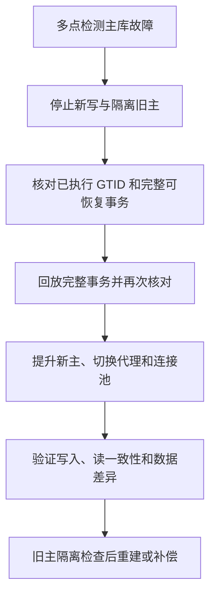

# MySQL主库故障如何处理？故障切换的方案有哪些？

日期：2026-09-27  
标签：#面试 #场景设计 #MySQL  
难度：中等  
来源：[牛面场景题](https://niumianoffer.com/nm_practice/questions?bank_id=bank_1757645675392050216&activeIndex=0)  
答案说明：独立整理（站内题目标记为 VIP，未读取会员答案）

## 一句话答案

先判定故障并阻断旧主写入，再核对候选副本事务完整性、提升新主并切换应用路由；切换后的数据差异、旧主重加入和业务重试必须单独处理。

## 面试口语版（约 80 秒）

“我会把故障切换分成检测、隔离、选主、切流和校验。先用多点探测确认主库不可用，防止只是应用到数据库的网络分区。关键是 fencing：在提升从库之前通过代理撤掉旧主写路由、关写权限或用可靠的基础设施隔离旧主；做不到隔离时宁可暂时停写，避免双主。然后核对候选副本已执行的 GTID，以及 relay log 中完整可恢复的事务，优先选择数据最完整且健康的副本；必要时先回放、核对，再开放写入并更新代理和连接池。异步复制下旧主可能有已提交但未复制的事务，所以要估计 RPO、核对订单或流水，不能承诺零丢失。最后旧主恢复时先隔离检查差异，按新主重建或谨慎补偿，不可直接变回主库。方案上可人工或自动编排异步复制，也可用 Group Replication/InnoDB Cluster 与 Router，但都要按拓扑、事务一致性设置和业务目标演练。”

## 切换顺序与故障分支

| 方案 | 适用场景 | 主要边界 |
| --- | --- | --- |
| 人工切换异步复制 | 低频故障、允许较长 RTO | 依赖值班响应和成熟操作手册 |
| 自动编排异步复制 | 需要较短 RTO | 必须可靠地判故障、fencing、选择候选并处理分叉 |
| Group Replication 单主模式 + Router | 接受组复制的部署和仲裁成本 | 组内可自动选新主；客户端仍需 Router/代理/应用切路由，读一致性取决于配置与积压 |

**例子与失败分支：** 主库 A 提交订单 `T100` 后断电，从库 B 只收到 `T99`。即使 B 很快被提升，新主也不会凭空拥有 `T100`；客户端若重试创建订单，需用业务幂等键判断新主状态，旧主 A 恢复后比对并决定补录或业务补偿。若 A 实际只是网络分区但还在接受写入，未隔离就提升 B 会产生分叉，事后合并代价更高。

## 关键细节与常见误区

- GTID 便于识别和比较事务，但“启用 GTID”本身不保证候选副本拥有旧主全部已提交事务。`Retrieved_Gtid_Set` 在事务内容尚未传完时也可能包含其 GTID，不能仅凭它决定提升；要核对完整可恢复的 relay log、回放后的 `Executed_Gtid_Set`、GTID 集差集与 errant transaction。
- 半同步只等副本收到并记录事件，不等同于副本已执行；若等待超时还可能退回异步。RPO 需要按当时实际模式和切换候选评估。
- MySQL Group Replication 单主模式可自动选主，但若新主还有待回放事务，立即开放读可能看到旧数据；需按 `group_replication_consistency` 等设置验证切换期间语义。
- RTO 是恢复服务的时间，RPO 是可接受的数据丢失窗口；缩短 RTO 常会增加自动化复杂度，降低 RPO 则需更强的复制/确认策略。

## 面试官递进追问

1. 如何区分主库宕机与应用到主库的网络分区？
2. 两个从库接收与执行 GTID 不一致，你怎样选择候选并控制数据丢失？
3. 旧主恢复后发现多了三笔新主没有的订单，你会如何处理并防止再次分叉？

## 自测与学习清单

- 用“主库真宕机”和“主库被网络隔离但仍可写”两个场景演练切换顺序。
- 列出每一步需要的证据：健康检查、fencing 结果、GTID 差集、回放状态、应用错误率。
- 记录切换 RTO、实际 RPO、重复写请求、旧主重加入与补偿结果，复盘自动化缺口。

## 参考资料

- [MySQL 8.4：GTID 故障切换与扩容](https://dev.mysql.com/doc/refman/8.4/en/replication-gtids-failover.html)、[复制模式](https://dev.mysql.com/doc/refman/8.4/en/replication.html)、[Group Replication 单主模式](https://dev.mysql.com/doc/refman/8.4/en/group-replication-single-primary-mode.html)、[MySQL Router 路由](https://dev.mysql.com/doc/mysql-router/8.4/en/mysql-router-innodb-cluster.html)（核对日期：2026-09-27）。
